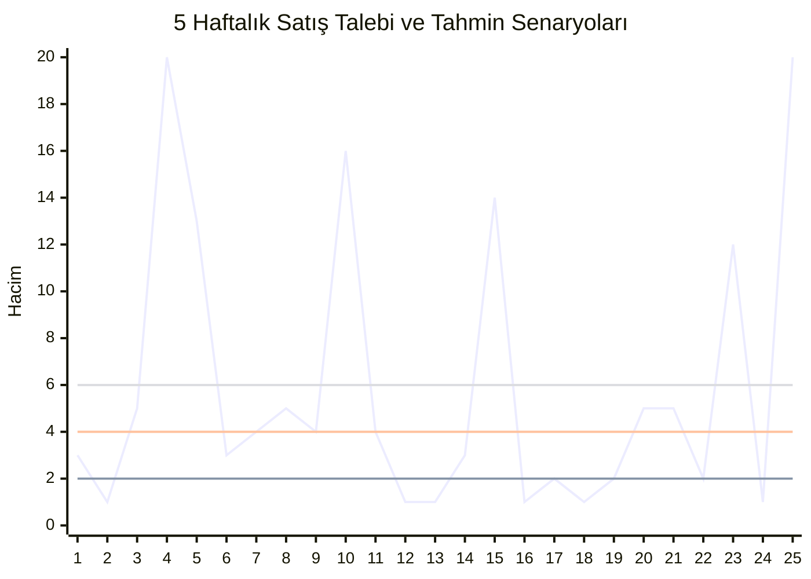

```mermaid
%%{init: {'theme': 'base', 'themeVariables': { 'fontSize': '13px'}}}%%
gantt
    title Expanding vs Rolling Window
    dateFormat X
    axisFormat %s
    
    section Expanding (Genişleyen)
    Train (T1)       :a1, 0, 10
    Test             :crit, 10, 12
    Train (T1+T2)    :a2, 0, 12
    Test             :crit, 12, 14
    Train (T1+T2+T3) :a3, 0, 14
    Test             :crit, 14, 16

    section Rolling (Kayan)
    Train (T1)       :b1, 0, 10
    Test             :crit, 10, 12
    Train (T2)       :b2, 2, 12
    Test             :crit, 12, 14
    Train (T3)       :b3, 4, 14
    Test             :crit, 14, 16
```

# 📈 Model Evaluation for Time-Series Forecasting


Zaman serisi tahmini (Time-Series Forecasting), verinin sıralı doğası nedeniyle geleneksel makine öğrenimi görevlerinden ayrılır. Bir modeli değerlendirmek, zamana duyarlı teknikler ve stratejik bir yaklaşım gerektirir.

Bu döküman, zaman serisi modellerinin değerlendirilmesinde kullanılan temel prensipleri, validasyon stratejilerini ve başarı metriklerini teknik bir derinlikle ele alır.

---

## 1. Temel Zorluklar ve Farklılıklar

Geleneksel makine öğreniminde veriler genellikle bağımsız ve aynı dağılıma sahip (IID) olarak kabul edilirken, zaman serilerinde bu durum geçerli değildir.

### ⏳ Temporal Dependency (Zaman Bağımlılığı)
Zaman serilerinde gözlemler zaman içinde sıralıdır ve mevcut değer genellikle önceki değerlere bağlıdır (otokorelasyon). 
* **Sorun:** Veriyi rastgele (random shuffle) "Eğitim" ve "Test" setlerine ayırmak, modelin geçmişten geleceği değil, "gelecekten geçmişi" öğrenmesine neden olur.
* **Çözüm:** Veri setleri her zaman kronolojik sıraya göre kesilmelidir.

### 💧 Data Leakage (Veri Sızıntısı)
Geleceğe ait bilgilerin (test seti) eğitim sürecine dahil olması durumudur.
* **Sonuç:** Model eğitimde harika performans gösterir ancak canlıya (production) alındığında çuvallar.
* **Kural:** Gelecek, geçmişi tahmin etmek için kullanılamaz.

---

## 2. Validasyon Stratejileri (Cross-Validation Techniques)

Zaman serilerinde standart *k-fold cross-validation* kullanılmaz. Bunun yerine "Walk-Forward Validation" (İleriye Yürüyen Doğrulama) teknikleri uygulanır.

### A. Hold-Out Yöntemi (Basit Kronolojik Bölme)
Veri seti belirli bir zaman noktasından itibaren ikiye (veya üçe) bölünür.
* **Eğitim Seti:** $t_0$'dan $t_n$'e kadar.
* **Test Seti:** $t_{n+1}$'den $t_{n+m}$'e kadar.

### B. Time Series Cross-Validation (Walk-Forward)
Bu yöntem, modelin zaman içindeki stabilitesini ölçmek için en güvenilir yoldur. İki ana yaklaşımı vardır:

#### 1. Expanding Window (Genişleyen Pencere)
Eğitim seti her adımda büyürken, test seti zaman ekseninde ileriye doğru kayar.
* **Kullanım Alanı:** Veri geçmişinin tamamı önemliyse ve "Concept Drift" (Veri dağılımının zamanla değişmesi) az ise kullanılır.

```text
Adım 1: [Train: Yıl 1-3] -> [Test: Yıl 4]
Adım 2: [Train: Yıl 1-4] -> [Test: Yıl 5]
Adım 3: [Train: Yıl 1-5] -> [Test: Yıl 6]
```
####  2. Rolling Window (Kayan Pencere)
Eğitim setinin boyutu sabit tutulur. Yeni veri eklendikçe, en eski veri eğitim setinden çıkarılır.

* **Kullanım Alanı:** Veri yapısı zamanla değişiyorsa (rejim değişikliği) ve modelin sadece yakın geçmişe odaklanması isteniyorsa kullanılır.
  
```text
Adım 1: [Train: Yıl 2-3] -> [Test: Yıl 4]
Adım 2:       [Train: Yıl 3-4] -> [Test: Yıl 5]
Adım 3:             [Train: Yıl 4-5] -> [Test: Yıl 6]
```

### 🆚 Karşılaştırma: Rolling vs. Expanding Window

Zaman serisi modellerinde doğrulama (validation) yaparken veri setinin nasıl bölündüğü modelin başarısını doğrudan etkiler. Aşağıda iki ana yöntemin mekanizması ve karşılaştırmalı analizi yer almaktadır.

#### 🎨 Görsel Anlatım (Visual Explanation)

**1. Expanding Window (Genişleyen Pencere)**
Veri seti kümülatif olarak büyür. Başlangıç noktası sabittir.
```text
Adım 1: | Train (Yıl 1) | -> Test (Yıl 2)
Adım 2: | Train (Yıl 1 + 2)      | -> Test (Yıl 3)
Adım 3: | Train (Yıl 1 + 2 + 3)           | -> Test (Yıl 4)

```

# 📊 Model Evaluation Metrics & Residual Analysis for Time-Series

Zaman serisi tahminlemesinde (Time-Series Forecasting) model başarısını ölçmek, sadece "doğru tahmini" bulmak değil, hatanın karakterini ve iş problemine etkisini anlamaktır. Tek bir metrik asla resmin tamamını göstermez.

Bu döküman, tahmin modellerini değerlendirirken kullanılan **Performans Metriklerini**, **Hata Analizi Yöntemlerini** ve **Karar Destek Tablolarını** teknik bir derinlikle ele alır.

---

## 1. Temel Hata Metrikleri (Scale-Dependent)
Bu metrikler verinin ölçeğine bağlıdır. Yani, elma satışlarını (binlerce) ve araba satışlarını (onlarca) aynı metrik değeriyle kıyaslayamazsınız.

### 📉 MAE (Mean Absolute Error)
Hataların mutlak değerlerinin ortalamasıdır. 
* **Özellik:** Tüm hatalara eşit ağırlık verir.
* **Kullanım:** Modelin "ortalama kaç birim saptığını" en saf haliyle anlatır.
$$MAE = \frac{1}{n} \sum_{i=1}^{n} |y_i - \hat{y}_i|$$

### ⚡ RMSE (Root Mean Squared Error)
Hataların karesinin ortalamasının kareköküdür.
* **Özellik:** Hataların karesini aldığı için **büyük hataları (outliers)** küçük hatalara göre çok daha ağır cezalandırır.
* **Kullanım:** Büyük bir hata yapmanın maliyetinin çok yüksek olduğu durumlarda (örneğin enerji şebekesi yük tahmini) tercih edilir.
$$RMSE = \sqrt{\frac{1}{n} \sum_{i=1}^{n} (y_i - \hat{y}_i)^2}$$

> **Uzman Notu (MAE vs RMSE):** Eğer RMSE değeri MAE değerinden çok büyükse, modeliniz bazı örneklerde çok büyük hatalar yapıyor (outlier üretiyor) demektir.

---

## 2. Yüzdesel ve Ölçekten Bağımsız Metrikler (Scale-Independent)
Farklı ölçekteki (yüksek hacimli vs. düşük hacimli) serileri karşılaştırmak için kullanılır.

### 📊 MAPE (Mean Absolute Percentage Error)
Hataları yüzdesel olarak ifade eder. İş birimlerinin (Business Stakeholders) en sevdiği metriktir.
* **Dezavantaj 1:** Gerçek değer ($y_i$) 0 olduğunda tanımsızdır (sonsuza gider).
* **Dezavantaj 2 (Asimetri):** Gereğinden az tahmin etmeyi (under-forecast), fazla tahmin etmeye (over-forecast) göre daha fazla cezalandırır.
$$MAPE = \frac{100\%}{n} \sum_{i=1}^{n} \left| \frac{y_i - \hat{y}_i}{y_i} \right|$$

### ⚖️ sMAPE (Symmetric MAPE)
MAPE'nin asimetrik yapısını ve 0'a bölünme sorununu (kısmen) düzeltmek için geliştirilmiştir. Değerler %0 ile %200 arasında değişir.
$$sMAPE = \frac{100\%}{n} \sum_{i=1}^{n} \frac{|y_i - \hat{y}_i|}{(|y_i| + |\hat{y}_i|)/2}$$

### 🌟 MASE (Mean Absolute Scaled Error) - Altın Standart
Modelin hatasını, "Naive Model"in (bir önceki değeri tahmin olarak kabul eden saf model: $\hat{y}_t = y_{t-1}$) hatasına oranlar.
* **MASE < 1:** Modeliniz, "dünü bugüne kopyalayan" saf modelden daha zeki.
* **MASE > 1:** Modeliniz başarısız, Naive yaklaşım daha iyi sonuç veriyor.
* **Avantajı:** Mevsimsellik içeren verilerde ve 0 değerlerinde oldukça stabildir.
$$MASE = \frac{MAE_{model}}{MAE_{naive}}$$

---

## 3. İleri Seviye ve İş Odaklı Metrikler

### ⚖️ WMAPE (Weighted MAPE)
Standart MAPE, hacmi 1 olan ürünle hacmi 1.000.000 olan ürünün hatasına eşit davranır. Perakende ve Tedarik Zinciri yönetiminde bu istenmez. WMAPE, hatayı hacme göre ağırlıklandırır.
$$WMAPE = \frac{\sum_{i=1}^{n} |y_i - \hat{y}_i|}{\sum_{i=1}^{n} |y_i|}$$

---

## 4. Residual (Artık) Analizi: Modeliniz Bilgiyi Tüketti mi?

İyi bir zaman serisi modelinde, hatalar (residuals) **White Noise (Beyaz Gürültü)** olmalıdır. Eğer hatalarda bir "desen" kaldıysa, model verideki sinyali tam yakalayamamış demektir.

### ✅ White Noise Kriterleri
1.  **Sıfır Ortalamalı:** $E[e_t] = 0$. Hatalar 0 etrafında rastgele dağılmalı. (Bias olmamalı).
2.  **İlişkisiz (Uncorrelated):** Hatalar geçmiş hatalarla korele olmamalıdır. (ACF grafiği temiz çıkmalı).
3.  **Sabit Varyans (Homoscedasticity):** Hataların boyutu zamanla artmamalı veya azalmamalıdır.
4.  **Normal Dağılım:** Hatalar Çan Eğrisi (Gaussian) şeklinde dağılmalıdır (Güven aralıklarının doğruluğu için şarttır).

### 🧪 İstatistiksel Test: Ljung-Box Testi
Sadece grafiğe bakmak yetmez. Otokorelasyonun olup olmadığını istatistiksel olarak test etmeliyiz.
* **H0 (Null Hypothesis):** Veri rastgele dağılmıştır (White Noise'dur).
* **p-value < 0.05:** H0 reddedilir. Hatalarda otokorelasyon var -> **Model Yetersiz.**
* **p-value > 0.05:** H0 reddedilemez. Hatalar rastgele -> **Model Başarılı.**

---

## 5. Karşılaştırmalı Karar Tablosu: Hangi Yöntem Ne Zaman?

| Senaryo | Önerilen Metrik | Neden? |
| :--- | :--- | :--- |
| **Büyük hatalar felaketse** (Örn: Enerji şebekesi çökmesi) | **RMSE** | Karesini aldığı için outlier'ları çok sert cezalandırır. |
| **Yorumlanabilirlik önemliyse** (Yönetim sunumları) | **MAE / MAPE** | "Ortalama X adet yanılıyoruz" demek kolaydır. |
| **Farklı hacimli binlerce ürün varsa** (Perakende) | **WMAPE** | Çok satan ürünlerin başarısı, az satanlardan daha önemlidir. |
| **Veride çok fazla 0 varsa** (Intermittent Demand) | **MASE** | MAPE sonsuza gider, MASE stabildir. |
| **Modelin ne kadar "zeki" olduğunu ölçmek için** | **MASE** | Basit bir kurala (Naive) göre ne kadar katma değer sağladığını gösterir. |

---

> **Pro Tip:** Asla tek bir metriğe güvenmeyin. Genellikle **RMSE** (model optimizasyonu için) ve **MAPE/WMAPE** (iş birimlerine raporlama için) birlikte kullanılır. Residual analizi ise modelin güvenilirliği ("Canlıya alınır mı?") sorusunun cevabıdır.


# 📉 Time-Series Forecasting: Model Evaluation Quiz Solutions

Bu doküman, **Time-Series Forecasting (Zaman Serisi Tahminleme)** modellerinin değerlendirilmesi, hata metrikleri ve validasyon stratejileri üzerine odaklanan **Quiz 5** sorularının detaylı çözümlerini ve teknik açıklamalarını içerir.

> **Özet:** Bu quiz, özellikle "Data Leakage", "RMSE vs MAPE karşılaştırması" ve "Validasyon Yöntemleri" konularındaki kavramsal anlayışı test etmektedir.

---

## 🧩 Quiz Soruları ve Teknik Çözümler

### 1. Neden rastgele eğitim-test bölmesi (random train-test split) zaman serisi verileri için uygun değildir?
**Soru:** Why is random train-test splitting not suitable for time-series data?
* A - it takes longer to compute
* **B - it can lead to data leakage by using future data for training** ✅
* C - it requires specific algorithms to process time-series
* D - it reduces the size of the training dataset

> **💡 Teknik Açıklama:**
> Zaman serilerinde veriler arasında zamansal bir bağımlılık (temporal dependency) vardır. Veriyi rastgele karıştırdığınızda, gelecekteki bir veri noktasını eğitim setine, geçmişteki bir noktayı test setine koyabilirsiniz. Bu durum, modelin geleceği görerek geçmişi tahmin etmesine (**Data Leakage**) neden olur ve yanıltıcı derecede yüksek başarı oranları verir.

---

### 2. Hangi bölme yöntemi, verinin önceki bölümlerini eğitim ve sonraki bölümlerini test için kullanmayı içerir?
**Soru:** Which splitting method involves using earlier portions of the data for training and later portions for testing?
* A - random train-test split
* **B - k-fold cross-validation** ✅
* C - chronological split
* D - rolling window split

> **💡 Teknik Açıklama:**
> Burada kastedilen standart k-fold değil, zaman serileri için uyarlanmış **Time Series Cross-Validation** (genellikle Nested Cross-Validation veya Blocked CV olarak da bilinir) yöntemidir. Bu yöntemde veri blokları zaman sırasına göre korunur; model geçmiş bloklarda eğitilir ve gelecek bloklarda test edilir.

---

### 3. Zaman serisi değerlendirmesi için "Rolling Window" (Kayan Pencere) kullanmanın temel avantajı nedir?
**Soru:** What is the main advantage of using a rolling window split for time-series evaluation?
* A - it reduces computation time
* B - it avoids overfitting
* **C - it mimics real-world scenarios with models predicting future unseen data** ✅
* D - it uses all data for both training and testing

> **💡 Teknik Açıklama:**
> Rolling Window yöntemi, modelin her adımda yeni gelen veriyi öğrenip bir sonraki adımı tahmin ettiği canlı (production) ortamı simüle eder. Bu, modelin zaman içinde değişen trendlere karşı dayanıklılığını ölçmenin en gerçekçi yoludur.

---

### 4. Tahminlemede "Pozitif Bias" neyi gösterir?
**Soru:** What does a positive bias in forecasting indicate?
* A - the model systematically under-predicts demand
* B - the model is unbiased and accurate
* C - the model performs better on larger datasets
* **D - the model systematically over-predicts demand** ✅

> **💡 Teknik Açıklama:**
> Bias formülü kaynağa göre değişebilir ancak bu cevap anahtarına göre Bias şu şekilde tanımlanmıştır: `Bias = Tahmin (Forecast) - Gerçek (Actual)`.
> Eğer sonuç **Pozitif (+)** ise, Tahmin > Gerçek demektir. Bu da modelin talebi olduğundan fazla tahmin ettiğini (**Over-prediction**) gösterir.

---

### 5. MAD ve RMSE arasındaki temel fark nedir?
**Soru:** What is the primary difference between MAD and RMSE?
* A - MAD penalizes larger errors more than RMSE
* **B - RMSE penalizes larger errors more than MAD** ✅
* C - MAD measures relative errors, while RMSE measures absolute errors
* D - MAD focuses on predicting average values, while RMSE focuses on predicting medians

> **💡 Teknik Açıklama:**
> * **MAD (Mean Absolute Deviation):** Hataların mutlak değerini alır ($|e|$). Doğrusal bir ceza uygular.
> * **RMSE (Root Mean Squared Error):** Hataların karesini alır ($e^2$). Karesi alınan büyük hatalar sonucu orantısız şekilde büyütür. Bu nedenle RMSE, büyük hataları (outlier) çok daha ağır cezalandırır.

---

### 6. Hangi metrik, Ortalama Mutlak Sapmayı (MAD) gerçek değerlerin ortalamasına bölerek normalleştirir?
**Soru:** Which metric normalizes the Mean Absolute Deviation (MAD) by the mean of the actual values?
* A - MAPE
* B - RMSE
* **C - rMAD** ✅
* D - Bias

> **💡 Teknik Açıklama:**
> **rMAD (Relative MAD)**, hatanın büyüklüğünü verinin ortalamasına göre oranlar. Formülü: $rMAD = \frac{MAD}{Mean}$. Bu, MAPE'ye bir alternatiftir ancak MAPE kadar yaygın kullanılmaz.

---

### 7. Neden MAPE zaman serisi tahminlemesi için her zaman güvenilir bir metrik değildir?
**Soru:** Why is MAPE not always a reliable metric for time-series forecasting?
* A - it is difficult to interpret
* B - it penalizes large errors less than RMSE
* **C - it is sensitive to small actual values and asymmetry in error treatment** ✅
* D - it cannot be used with rolling window splits

> **💡 Teknik Açıklama:**
> **MAPE (Mean Absolute Percentage Error)** formülünde paydada "Gerçek Değer" ($y_t$) bulunur.
> 1.  Eğer $y_t = 0$ ise sonuç tanımsızdır (sonsuz).
> 2.  Eğer $y_t$ çok küçükse, hata oranı yapay olarak devasa çıkar (Örn: Gerçek 1, Tahmin 2 ise hata %100'dür).

---

### 8. Bir tahminleme görevinde, bir model en iyi RMSE'ye ama en kötü MAPE'ye sahiptir. Bu ne anlama gelir?
**Soru:** In a forecasting task, a model has the best RMSE but the worst MAPE. What does this imply?
* A - the model is inaccurate overall
* **B - the model handles small actual values poorly but minimizes large errors effectively** ✅
* C - the model predicts median values better than averages
* D - the model overfits the training data

> **💡 Teknik Açıklama:**
> * **İyi RMSE:** Model büyük hatalar (outlier) yapmıyor demektir.
> * **Kötü MAPE:** Model, gerçek değerin (hacmin) çok düşük olduğu zamanlarda oransal olarak büyük hatalar yapıyor demektir.
> * **Örnek:** Model 10.000 adetlik satışta 100 hata yaparsa (Küçük % hata), ama 5 adetlik satışta 4 hata yaparsa (Büyük % hata - %80), MAPE bozulur ama RMSE çok etkilenmez.

---

### 9. Büyük hataların özellikle maliyetli olduğu durumlarda hangi metrik en uygundur?
**Soru:** Which metric is most appropriate when large errors are especially costly?
* A - Bias
* B - MAD
* C - MAPE
* **D - RMSE** ✅

> **💡 Teknik Açıklama:**
> Enerji santralleri veya hayati medikal cihazlar gibi "büyük bir hatanın felaket olduğu" durumlarda, o tek büyük hatayı matematiksel olarak parlatıp modele "bunu düzelt" diyen metrik **RMSE**'dir (karesini aldığı için).

---

### 10. Zaman serisi tahminlemesi için hangi değerlendirme metriğine öncelik verileceğine nasıl karar vermelisiniz?
**Soru:** How should you decide which evaluation metric to prioritize for time-series forecasting?
* A - choose the metric with the smallest value
* **B - consider the specific business goals and consequences of forecasting errors** ✅
* C - prioritize metrics that are easy to calculate
* D - use MAPE in all cases

> **💡 Teknik Açıklama:**
> Veri biliminde "tek doğru metrik" yoktur.
> * Eğer envanter yönetiyorsanız ve ürünler ucuzsa **MAE** yeterlidir.
> * Eğer finansal bir çöküşü tahmin ediyorsanız **RMSE** kritiktir.
> * Eğer yönetim kuruluna sunum yapıyorsanız yüzdesel olduğu için **MAPE** tercih edilir.
> Karar her zaman **iş hedeflerine (Business Goals)** göre verilir.

---
# ⏳ Time-Series Model Evaluation: Train-Test Splits

Geleneksel makine öğreniminde (Traditional ML) verilerin **I.I.D.** (Independent and Identically Distributed - Bağımsız ve Özdeş Dağılımlı) olduğu varsayılır. Bu nedenle rastgele (random) bölme yapılabilir. Ancak **Zaman Serilerinde** durum farklıdır; veriler arasında **zamansal bir bağımlılık (autocorrelation)** vardır.

Bu doküman, zaman serisi tahmin modellerini değerlendirirken kullanılan doğru validasyon stratejilerini, teknik ayrımları ve uygulama yöntemlerini içerir.

---

## 🚫 Neden Rastgele (Random) Split Yapamayız?
Zaman serilerinde rastgele bölme yapmak **Data Leakage (Veri Sızıntısı)** yaratır.
* **Sorun:** Gelecekteki bir veri noktasını eğitim (train) setine, geçmişteki bir noktayı test setine koyarsanız; model "geleceği görerek" geçmişi tahmin etmeye çalışır.
* **Sonuç:** Model eğitimde harika sonuçlar verir ancak canlı (production) ortamda başarısız olur.
* **Kural:** Bölme işlemi her zaman **Zaman Duyarlı (Time-Aware)** olmalıdır. Gelecek, geçmişi eğitmek için kullanılamaz.

---

## 🛠️ Bölme Yöntemleri (Splitting Techniques)

### Method 1 & 2: Simple Chronological Split (Hold-Out)
Veri seti, zaman ekseninde tek bir kesim noktası belirlenerek ikiye ayrılır. Tarih bazlı (Date-based) veya oran bazlı (%70-%30) yapılabilir.

* **Yapısı:** İlk %80 Eğitim, Son %20 Test.
* **Kullanımı:** Veri seti çok büyükse ve zaman içinde istatistiksel özellikleri (dağılımı) çok değişmiyorsa (Stationary) uygundur.

```text
[Eğitim Verisi ........................] | [Test Verisi]
t_0 ---------------------------------> t_split ------> t_end
```


## 🔄 Method 3: Cross-Validation Strategies (Geriye Dönük Test Stratejileri)

Zaman serisi analizinde tek bir test seti (single test set) kullanmak bazen yanıltıcı sonuçlar doğurabilir. Örneğin, seçilen test dönemi çok olağandışı bir döneme (outlier/anomaly period) denk gelebilir ve bu da modelin genel başarısını yansıtmaz.

Bu riski minimize etmek için **Cross-Validation (Çapraz Doğrulama)** uygulanır. Ancak, zaman serilerinin sıralı yapısı gereği standart *K-Fold* yerine **Walk-Forward Validation (İleriye Yürüyen Doğrulama)** yöntemi kullanılır.

Bu yöntemde temel olarak iki ana yaklaşım vardır. Literatürde genellikle karıştırılsa da teknik farkları belirgindir. Aşağıda, en yaygın kullanılan yaklaşım detaylandırılmıştır:

### 📈 A. Expanding Window (Genişleyen Pencere)

Bu yöntem, Scikit-Learn kütüphanesindeki `TimeSeriesSplit` fonksiyonunun varsayılan çalışma mantığıdır.

#### ⚙️ Çalışma Prensibi (Mechanism)
Eğitim seti (training set) her iterasyonda kümülatif olarak büyürken, test seti (test set) zaman ekseninde ileriye doğru kayar. Başlangıç noktası sabittir, ancak bitiş noktası her adımda ilerler.

**Görselleştirme (Visualization):**

```text
Adım 1: | Train (T1)       | -> [Test (T2)]
Adım 2: | Train (T1 + T2)  | -------------> [Test (T3)]
Adım 3: | Train (T1 + T2 + T3)            | -------------> [Test (T4)]
```

#### 🔑 Temel Nitelikler
* **Hafıza (Memory):** Model, tüm geçmiş veriyi (historical data) hatırlar ve kullanır. Veri seti kesilmez, sürekli eklenir.

* Kütüphane Desteği (Library Support): Python'da sklearn.model_selection.TimeSeriesSplit bu mantıkla çalışır.

* **Kullanım Senaryosu (Use Case):** Veri geçmişinin tamamının (entire history) model başarısı için önemli olduğu ve eski verilerin hala geçerliliğini koruduğu durumlarda tercih edilir.

* 💡 Uzman Notu: Bu yöntem, veri miktarı arttıkça eğitim süresini (training time) uzatabilir ancak uzun vadeli trendleri (long-term trends) yakalamak için idealdir.

  ### 🔄 B. Rolling Window (Kayan Pencere)

Bu yöntemde eğitim setinin boyutu sabittir (fixed size). Pencere zaman ekseninde ilerledikçe, yeni veri eğitim setine eklenir ve en eski veri eğitim setinden çıkarılır.

#### ⚙️ Çalışma Prensibi (Mechanism)
Modelin hafızası sınırlıdır; geçmişi bir "kuyruk" gibi takip eder.

**Görselleştirme (Visualization):**
```text
Adım 1: | Train (T1-T2) | -> [Test (T3)]
Adım 2:       | Train (T2-T3) | -> [Test (T4)]
Adım 3:             | Train (T3-T4) | -> [Test (T5)]
```

### 🔄 B. Rolling Window (Kayan Pencere)

Bu strateji, modelin hafızasını sınırlar ve sadece belirli bir yakın geçmişe odaklanmasını sağlar.

#### 🔑 Temel Nitelikler ve Kullanım

* **Özellik (Feature):** Model sadece en yakın geçmişi (**recent history** / **sliding window**), örneğin son 1 yılı hatırlar. Pencere kaydıkça, en eski verilerin etkisi silinir (**impact is removed**).
* **Kullanım (Usage):** Veri setinde **Concept Drift** (Kavram Kayması / Rejim Değişikliği) varsa tercih edilir.
    * *Örnek:* 5 yıl önceki piyasa koşulları veya tüketici davranışları bugünü temsil etmiyorsa (**obsolete data**), modelin o verileri "unutması" (**forgetting mechanism**) performans için daha iyidir.

---

### 🐍 Teknik Uygulama Notu (Technical Implementation Note: Python/Sklearn)

Scikit-learn kütüphanesindeki `TimeSeriesSplit` sınıfı, varsayılan ayarlarıyla **Expanding Window** (Genişleyen Pencere) mantığıyla çalışır.

> **💡 Uzman İpucu (Expert Tip):** Eğer `TimeSeriesSplit`'i **Rolling Window** olarak kullanmak istiyorsanız, `max_train_size` parametresini ayarlamanız gerekir. Aksi takdirde eğitim seti sürekli büyür.

Hiperparametre optimizasyonu (**Hyperparameter Optimization**) süreçlerinde (örneğin `GridSearchCV` veya `RandomizedSearchCV`) `cv` parametresine bu objeyi vermemiz gerekir.

---

### ✅ Doğru İş Akışı (Correct Workflow)

Başarılı bir zaman serisi modellemesi için izlenmesi gereken standart süreç şöyledir:

1.  **Veriyi Ayır (Split):** Veriyi kronolojik olarak (**chronologically**) ikiye ayır:
    * `X_train_full`: %80 (Eğitim ve Validasyon döngüsü için)
    * `X_test`: %20 (Sadece Final Test için)
2.  **Test Setini Kilitle (Hold-out):** `X_test` setini "kasaya kilitle" (**lock away**). Model canlıya (**production**) alınana kadar bu veriye asla dokunma (**No peeking / Avoid Look-ahead Bias**).
3.  **Çapraz Doğrulama (Cross-Validation):** `X_train_full` üzerinde `TimeSeriesSplit` kullanarak Hiperparametre Taraması (**Validation**) yap.
4.  **Final Değerlendirme (Evaluation):** En iyi parametrelerle (**best parameters**) eğitilen modeli `X_test` üzerinde test et ve son performansı ölç.

#### 💻 Python Uygulama Kodu

```python
from sklearn.model_selection import TimeSeriesSplit

# 5 parçalı Cross-Validation
# Eğer Rolling Window isteniyorsa 'max_train_size' belirtilmeli!
tscv = TimeSeriesSplit(n_splits=5, max_train_size=None) # None = Expanding, Int = Rolling

for train_index, val_index in tscv.split(X):
    # İndeksleri kullanarak veriyi bölme
    X_train, X_val = X[train_index], X[val_index]
    y_train, y_val = y[train_index], y[val_index]
    
    # Buradan sonra model eğitimi ve validasyonu yapılır
    # model.fit(X_train, y_train)
    # ...

```

# ⚔️ Zaman Serisi Validasyon Stratejileri: Karşılaştırmalı Analiz

Zaman serisi modellerini doğrularken (validation) kullanılacak yöntem, veri setinin doğasına ve iş probleminin gerekliliklerine göre seçilmelidir. Aşağıdaki tablolar ve görseller, **Rolling** (Kayan) ve **Expanding** (Genişleyen) pencere yöntemleri ile **Basit Kronolojik Bölme** arasındaki teknik farkları özetlemektedir.

---

## 1. 🆚 Karşılaştırma: Rolling vs. Expanding Window

Bu bölüm, iki ana çapraz doğrulama (cross-validation) stratejisinin teknik özelliklerini kıyaslar.

### 🎨 Visual Concept


# 📉 Evaluation Metrics for Retail Demand Forecasting

Perakende sektöründe talep tahmini (Retail Demand Forecasting), envanter yönetimi, fiyatlandırma stratejileri ve tedarik zinciri optimizasyonu için kritik öneme sahiptir. Veriyi doğru bölmek ve modeli eğitmek sadece başlangıçtır; asıl mesele modelin başarısını **doğru metriklerle** ölçmektir.

Farklı metrikler, hatanın farklı yönlerini (büyüklük, yön, ağırlık) yakalar. Aşağıda, perakende talep tahminlemesinde kullanılan en kritik metrikler, teknik detayları ve kullanım senaryoları yer almaktadır.

---

## 1. Bias (Yanlılık / Sapma)
Bias, tahmin edilen değerler ($\hat{y}$) ile gerçek değerler ($y$) arasındaki sistematik sapmayı ölçer. Hataların ortalamasıdır.

$$Bias = \frac{1}{n} \sum_{i=1}^{n} (\hat{y}_i - y_i)$$

*Burada:*
* $y$: Gerçek satış/talep değeri
* $\hat{y}$: Modelin tahmin ettiği değer
* $n$: Gözlem sayısı

### 🎯 Neden Önemlidir?
Bias, modelinizin "yönsel" bir hatası olup olmadığını gösterir.
* **Pozitif Bias (Over-prediction):** Model sürekli gerekenden fazlasını tahmin ediyordur.
    * *Perakende Riski:* Gereksiz stok maliyeti (Overstocking), imha maliyetleri, nakit akışının stoğa bağlanması.
* **Negatif Bias (Under-prediction):** Model sürekli gerekenden azını tahmin ediyordur.
    * *Perakende Riski:* Stok tükenmesi (Stockouts), satış kaybı (Lost Sales), müşteri memnuniyetsizliği.

> **Uzman Notu:** Sadece Bias'a bakarak modelin başarısı ölçülmez. Pozitif ve negatif hatalar birbirini götürebilir (örn: bir gün +100, ertesi gün -100 hata yaparsanız Bias 0 çıkar ama model kötüdür). Bu yüzden Bias, her zaman MAE veya RMSE ile birlikte yorumlanmalıdır.

---

## 2. Mean Absolute Deviation (MAD / MAE)
Tahmin edilen ve gerçek değerler arasındaki mutlak farkların ortalamasıdır. Hatanın yönüne (pozitif/negatif) bakmaksızın, hatanın **büyüklüğüne** odaklanır.

$$MAD = \frac{1}{n} \sum_{i=1}^{n} |y_i - \hat{y}_i|$$

### 🎯 Neden Önemlidir?
* **Yorumlanabilirlik:** Veri ile aynı birimdedir. "Günde ortalama 20 adet hata yapıyoruz" demek yöneticiler için anlaşılırdır.
* **Güvenlik Stoğu (Safety Stock):** Lojistik planlamasında güvenlik stoğu belirlenirken genellikle MAD kullanılır.
* **İstatistiksel Özellik:** MAD, medyan tahmini optimize eder. Eğer veri setinizde çok fazla aykırı değer (outlier) varsa, MAD, RMSE'ye göre daha dirençli (robust) bir metriktir.

---

## 3. Relative Mean Absolute Deviation (rMAD)
MAD değerinin, gerçek değerlerin ortalamasına bölünmesiyle elde edilir. Bu işlem MAD'yi normalize eder ve ölçekten bağımsız hale getirir.

$$rMAD = \frac{MAD}{\bar{y}} = \frac{\sum |y_i - \hat{y}_i|}{\sum y_i}$$

### 🎯 Neden Önemlidir?
* **Karşılaştırılabilirlik:** Farklı satış hacmine sahip ürünleri (çok satan "Fast-mover" vs. az satan "Slow-mover") kıyaslamak için kullanılır.
* **Örnek:** rMAD %10 ise, hata payınız ortalama talebin %10'u kadardır.
* **Dikkat:** Düşük hacimli (low-demand) ürünlerde rMAD ve diğer oransal hatalar genellikle yüksek çıkar. Bu istatistiksel bir beklentidir; az satan ürünlerin volatilitesi daha yüksektir.

---

## 4. Mean Absolute Percentage Error (MAPE)
Tahmin hatasının mutlak yüzdesel ortalamasıdır. Literatürde en yaygın görülen metriklerden biridir ancak perakendede ciddi dezavantajları vardır.

$$MAPE = \frac{100\%}{n} \sum_{i=1}^{n} \left| \frac{y_i - \hat{y}_i}{y_i} \right|$$

### ⚠️ Kritik Dezavantajlar
1.  **Sıfıra Bölme Hatası (Sensitivity to Small Values):** Gerçek satış ($y_i$) 0 olduğunda (ki perakendede bazı günler satış olmaz), MAPE tanımsızdır (sonsuz). Gerçek değer çok küçükse (örn: 1), hata oranı yapay olarak devasa çıkar.
2.  **Asimetri (Asymmetry in Error Treatment):** MAPE, gereğinden az tahmin etmeyi (under-forecast), fazla tahmin etmeye (over-forecast) göre daha ağır cezalandırır.
    * *Örnek:* Gerçek=100, Tahmin=150 (Over) -> Hata %50
    * *Örnek:* Gerçek=100, Tahmin=50 (Under) -> Hata %50
    * *Ancak:* Payda değiştiğinde işler karışır. Modelin finansal tahminlerdeki cezalandırma yapısı dengesizleşebilir.

> **Uzman Tavsiyesi:** Perakendede "Intermittent Demand" (Kesikli Talep) sık görüldüğü için MAPE yerine genellikle **WMAPE (Weighted MAPE)** veya **MASE** tercih edilmelidir.

---

## 5. Root Mean Square Error (RMSE)
Hataların karesinin ortalamasının kareköküdür. MAD'den farklı olarak, hataların karesini aldığı için **büyük hataları** çok daha ağır cezalandırır.

$$RMSE = \sqrt{\frac{1}{n} \sum_{i=1}^{n} (y_i - \hat{y}_i)^2}$$

### 🎯 Neden Önemlidir?
* **Büyük Hataların Maliyeti:** Eğer işletmeniz için "büyük bir hata yapmak", "birçok küçük hata yapmaktan" çok daha kötüyse (örneğin: tüm stoğun bitmesi veya fabrikanın durması), RMSE kullanmalısınız.
* **Ortalama Tahmini:** RMSE, istatistiksel olarak ortalamayı (mean) tahmin etmeye çalışır.

---

## 📊 Karşılaştırmalı Özet Tablosu

| Metrik | Odak Noktası | Avantaj | Dezavantaj | En İyi Kullanım Alanı |
| :--- | :--- | :--- | :--- | :--- |
| **Bias** | Yön (Alt/Üst Tahmin) | Sistematik hataları (sürekli fazla/eksik tahmin) gösterir. | Tek başına başarıyı ölçemez (Hatalar birbirini götürür). | Stok politikası belirleme (Overstock vs Stockout riski). |
| **MAD (MAE)** | Hata Büyüklüğü (Lineer) | Yorumlaması kolaydır, outlier'lara karşı dirençlidir. | Büyük hataları RMSE kadar cezalandırmaz. | Genel envanter yönetimi, Güvenlik stoğu hesabı. |
| **RMSE** | Hata Büyüklüğü (Karesel) | Büyük hataları ağır cezalandırır. | Outlier'lardan çok etkilenir. Yorumlaması MAE kadar doğrudan değildir. | Büyük hataların maliyetinin çok yüksek olduğu durumlar (Finans, Enerji). |
| **MAPE** | Yüzdesel Hata | Farklı ölçekteki ürünleri kıyaslamayı sağlar. Yöneticiler sever. | 0 satış olduğunda patlar (Tanımsız). Asimetriktir. | Yüksek hacimli ve düzenli satışa sahip ürünler. |
| **rMAD / WMAPE** | Normalize Hata | Hacim ağırlıklı hatayı gösterir. 0 değerlerinde MAPE gibi patlamaz. | Hesaplanması MAPE'den bir tık daha karmaşıktır. | **Perakende Standardı.** Az ve çok satan ürünlerin olduğu karma portföyler. |

---

### 💡 Sonuç ve Strateji
Perakende talep tahminlemesinde "tek bir doğru metrik" yoktur. Genellikle hibrit bir yaklaşım izlenir:
1.  **Model Optimizasyonu için:** **RMSE** veya **MAE** kullanılır (Matematiksel türevlenebilirlik ve ceza mekanizması için).
2.  **İş Raporlaması (Business Reporting) için:** **WMAPE (veya rMAD)** kullanılır (Yöneticilere "Hata oranımız %15" diyebilmek için).
3.  **Stok Riski Analizi için:** **Bias** kontrol edilir (Sürekli eksik mi tahmin ediyoruz?).

*Bu döküman, veri bilimi projelerinizde model değerlendirme aşaması için bir rehber niteliğindedir.*

# 📊 Evaluation Metrics for Retail Demand Forecasting II: Holistic Diagnosis

Perakende talep tahminlemesinde (Retail Demand Forecasting) modelleri değerlendirirken tek bir metriğe güvenmek, uçağı sadece "yükseklik göstergesi" ile uçurmaya benzer; hızı veya yönü göremezsiniz. 

Bu döküman, bir XGBoost modelinin performans çıktılarını (MAE, Bias, RMSE, rMAD, MAPE) yan yana koyarak nasıl **detaylı bir model teşhisi** yapılacağını analiz eder.

---

## 1. Metriklerin Toplu Analizi (The Line-up)

Modelin sağlığını ölçmek için aşağıdaki metrikleri bir arada raporluyoruz. Bu yaklaşım, sorunun kaynağını tespit etmemizi sağlar:
* **Hata Büyüklüğü (Magnitude):** MAE ve RMSE.
* **Sistematik Sapma (Direction):** Bias.
* **Göreceli Performans (Relativity):** rMAD ve MAPE.

### 🧪 Vaka Analizi: XGBoost Baseline Sonuçları

Aşağıdaki değerler, standart bir XGBoost modelinin test seti üzerindeki performansını temsil etmektedir. Gelin bu sayıların "Veri Bilimi" ve "Perakende Operasyonu" açısından ne anlama geldiğini inceleyelim.

#### 📉 1. MAE (Mean Absolute Error) ≈ 117 Units
> **Durum:** Günlük satışların genellikle **300-800 birim** arasında değiştiği bir seride, model ortalama **117 birim** hata yapıyor.
>
> **Uzman Yorumu:** Model, ortalama bir günde sipariş toplama sürecinde (order pick-bin) yaklaşık 100-120 birimlik bir sapma yaratıyor. Satış hacmi (800) göz önüne alındığında bu kabul edilebilir bir başlangıçtır, ancak mükemmel değildir.

#### ⚖️ 2. Bias ≈ -18 Units
> **Durum:** Sonuç negatiftir.
>
> **Uzman Yorumu (Under-prediction Risk):** Model, sistematik olarak gerçeğin altında tahmin yapıyor (**Negative Bias**). 
> * **İş Riski:** Perakendede bu durum, **"Stok Yok" (Stockout)** riskine ve potansiyel ciro kaybına (Lost Sales) işaret eder. Model talebi yakalayamıyor, gerisinde kalıyor.
> * **Teknik Aksiyon:** Kayıp fonksiyonuna (Loss Function) asimetrik bir ceza ekleyerek veya "Safety Stock" (Güvenlik Stoğu) çarpanını artırarak bu bias düzeltilmelidir.

#### ⚡ 3. RMSE (Root Mean Square Error) ≈ 171 Units
> **Durum:** $RMSE (171) > MAE (117)$. Aradaki fark belirgindir.
>
> **Uzman Yorumu (Variance & Outliers):** RMSE'nin MAE'den bu kadar yüksek olması, modelin **büyük hatalar** (large spikes) yaptığını gösterir.
> * Model, "sıradan günleri" iyi tahmin ediyor olabilir, ancak promosyon veya özel günlerdeki (tallest peaks) ani talep artışlarını yakalayamıyor ve karesel ceza (squared error) nedeniyle RMSE yükseliyor.

#### 📊 4. MAD & rMAD (Relative MAD) ≈ 0.83 (%83)
> **Durum:** $MAD \approx 140$ ve $rMAD \approx 0.83$.
>
> **Uzman Yorumu (Variability Check):** Burada rMAD, modelin hatasının, serinin kendi doğal değişkenliğine (variability) oranı olarak yorumlanmıştır. 
> * Hata, verinin kendi dalgalanmasının %83'ü kadar. Bu, modelin serideki varyansın (bilginin) bir kısmını açıkladığını ancak hala önemli bir kısmını "gürültü" veya "açıklanamayan varyans" olarak bıraktığını gösterir. Model doğal yayılımı (spread) tam olarak kavrayamamış.

#### 🏷️ 5. MAPE (Mean Absolute Percentage Error) ≈ 28%
> **Durum:** Ortalama mutlak yüzdesel hata %28.
>
> **Uzman Yorumu:** Model, gerçek talebi ortalama olarak dörtte bir veya üçte bir oranında ıskalıyor.
> * **Perakende Bağlamı:** Hızlı tüketim (FMCG) için %28 iyileştirilmesi gereken bir orandır. Ancak moda veya lüks tüketim gibi yüksek volatiliteli alanlarda "işletilebilir" (serviceable) bir oran kabul edilebilir.

---

## 2. Karşılaştırmalı Teşhis Tablosu (Diagnostic Matrix)

Hangi metriğin neyi işaret ettiğini ve bu XGBoost örneğindeki karşılığını özetleyen teknik tablo:

| Metrik | Ne Ölçüyor? | XGBoost Sonucu | Teşhis & İş Anlamı |
| :--- | :--- | :--- | :--- |
| **MAE** | Ortalama Hata (Lineer) | **117 birim** | "Günde ortalama 117 ürün yanılıyoruz." |
| **Bias** | Hatanın Yönü | **-18 birim** | **Tehlike:** Talebi azımsıyoruz. Müşteri ürünü bulamayabilir (Under-forecasting). |
| **RMSE** | Büyük Hatalar (Karesel) | **171 birim** | MAE ile fark büyük. Kampanya dönemleri veya ani piklerde model çuvallıyor. |
| **rMAD** | Değişkenliğe Göre Hata | **0.83** | Model verinin karmaşıklığını tam çözemedi, varyansın büyük kısmı hala hatada. |
| **MAPE** | Yüzdesel Hata | **%28** | Yönetim raporu için makul, ancak tedarik zinciri optimizasyonu için %20 altına inilmeli. |

---

## 3. Uzman Sonuç Bildirgesi (Executive Summary)

Bu XGBoost modeli **"Tutucu" (Conservative)** bir modeldir:
1.  **Negatif Bias:** Risk almaktan kaçınıyor ve talebi olduğundan az tahmin ediyor.
2.  **Yüksek RMSE:** Beklenmedik talep patlamalarını (Outliers) tahmin etmekte zorlanıyor.
3.  **Sonuç:** Model şu haliyle "Otomatik Sipariş" sistemine bağlanırsa **stoksuz kalma (stock-out)** sorunları yaşanır. Modelin hiperparametreleri, ani yükselişleri (spikes) daha iyi yakalayacak şekilde optimize edilmelidir.

# 📉 Model Evaluation Case Study: The Metric Paradox

Zaman serisi tahminlemesinde sıkça karşılaşılan bir yanılgı şudur: "En düşük hataya sahip model en iyisidir." Ancak bu vaka analizi, farklı metriklerin (MAPE, RMSE, MAD) birbirleriyle nasıl çelişebileceğini ve her birinin aslında verinin farklı bir istatistiksel özelliğini (Mean, Median, Mode) optimize ettiğini kanıtlamaktadır.

Bu çalışma, Nicolas Vandeput'un *Data Science for Supply Chain Forecasting* kitabındaki ünlü örneğe dayanmaktadır.

---

## 1. Veri Seti ve Senaryo

Elimizde 5 haftalık, oldukça dalgalı (volatile) günlük satış verileri var. Veri seti 1 ile 20 arasında değişen, ani yükselişler (spikes) içeren bir yapıya sahip.

### 📅 Günlük Satış Verileri (Actual Demand)

| Gün | W1 | W2 | W3 | W4 | W5 |
| :--- | :--- | :--- | :--- | :--- | :--- |
| **Pzt** | 3 | 3 | 4 | 1 | 5 |
| **Sal** | 1 | 4 | 1 | 2 | 2 |
| **Çar** | 5 | 5 | 1 | 1 | 12 |
| **Per** | 20 | 4 | 3 | 2 | 1 |
| **Cum** | 13 | 16 | 14 | 5 | 20 |


### 🔮 Tahmin Senaryoları (Forecast Scenarios)
Karmaşık algoritmalar yerine, üç farklı "sabit" tahmin (naive constant forecasts) stratejisini test ediyoruz:

1.  **Forecast #1 (Low):** Günde sabit **2 adet**.
2.  **Forecast #2 (Medium):** Günde sabit **4 adet**.
3.  **Forecast #3 (High):** Günde sabit **6 adet**.

---

## 2. Metrik Karşılaştırması ve Sonuçlar

Her bir tahmin senaryosu için **Bias**, **MAPE**, **MAD (MAE)** ve **RMSE** hesaplandığında ortaya şaşırtıcı bir tablo çıkıyor. Hiçbir tahmin, tüm metriklerde "kazanan" değildir.

| Metrik | Forecast #1 (Tahmin: 2) | Forecast #2 (Tahmin: 4) | Forecast #3 (Tahmin: 6) |
| :--- | :--- | :--- | :--- |
| **Bias** | -3.9 (Çok Eksik) | -1.9 (Eksik) | **0.1 (Unbiased - En İyi) 🏆** |
| **MAPE** | **64% (En İyi) 🏆** | 109% | 180% (En Kötü) |
| **MAD** | 4.4 | **4.1 (En İyi) 🏆** | 4.8 |
| **RMSE** | 7.1 (En Kötü) | 6.2 | **5.9 (En İyi) 🏆** |

---

## 3. 🧠 Teknik Derinlemesine Analiz: Neden Böyle Oldu?

Bu tablo, veri bilimindeki temel optimizasyon kurallarının canlı kanıtıdır. İşte her metriğin neden farklı bir kazanan seçtiğinin teknik açıklaması:

### A. Neden RMSE, Forecast #3'ü (6 adet) Seçti?
* **Matematiksel İlke:** RMSE (Root Mean Squared Error), hataların karesini alır. Bu işlem, büyük hataları (outliers) aşırı cezalandırır. Hatayı minimize etmek için RMSE, istatistiksel olarak **Ortalama'ya (Mean)** yakınsamaya çalışır.
* **Vaka:** Veri setinin aritmetik ortalaması yaklaşık **5.92**'dir. Bu değere en yakın tahmin **Forecast #3 (6)** olduğu için RMSE burada en düşük çıkar.
* **Mesaj:** "Eğer büyük hatalardan (stok tükenmesi, krizler) korkuyorsan, ortalamaya oyna."

### B. Neden MAD, Forecast #2'yi (4 adet) Seçti?
* **Matematiksel İlke:** MAD (veya MAE), hataların mutlak değerini alır. Bu metrik, istatistiksel olarak **Medyan'a (Median)** yakınsamaya çalışır.
* **Vaka:** Veri setindeki değerleri sıraladığımızda medyan değerin **4** olduğunu görürüz. Bu yüzden **Forecast #2 (4)**, MAD açısından rakipsizdir.
* **Mesaj:** "Eğer istikrarlı ve dengeli bir tahmin istiyorsan, medyana oyna."

### C. Neden MAPE, Forecast #1'i (2 adet) Seçti?
* **Matematiksel İlke:** MAPE (Mean Absolute Percentage Error), asimetrik bir cezalandırma yapısına sahiptir.
    * Gerçek satış düşük (örn: 1) iken yüksek tahmin yaparsanız (örn: 6), hata %500 olur.
    * Gerçek satış yüksek (örn: 20) iken düşük tahmin yaparsanız (örn: 2), hata en fazla %100'e yaklaşabilir (Asla %100'ü geçemez).
* **Sonuç:** MAPE, devasa yüzdesel hatalardan kaçınmak için **düşük tahmin yapmayı (under-forecasting)** ödüllendirir.
* **Vaka:** Veride çok fazla "1" ve "2" gibi küçük değerler var. Forecast #3 (6) buralarda %500 hata yaparken, Forecast #1 (2) çok az hata yapar.
* **Mesaj:** "MAPE kullanırsan modelin risk almaz, korkak davranır ve eksik tahmin yapar."

---

## 4. 🚀 Karar Matrisi: Hangi Senaryoda Hangi Tahmin?

İş hedefine (Business KPI) göre hangi modeli seçmelisiniz?

| İş Hedefi (Goal) | Önerilen Model | Neden? |
| :--- | :--- | :--- |
| **Maliyet Minimizasyonu** (Stoksuz kalmak çok pahalıysa) | **Forecast #3** (RMSE Winner) | Bias neredeyse 0'dır. Toplam talebi tam karşılar. Büyük talep günlerini ıskalamaz. |
| **Denge / Stabilite** (Lojistik planlama) | **Forecast #2** (MAD Winner) | "Sıradan bir günde" en az hatayı bu model yapar. |
| **KPI Raporlama / Düşük Stok Maliyeti** | **Forecast #1** (MAPE Winner) | Eğer yönetim sadece yüzdesel hataya bakıyorsa bu model "başarılı" görünür ama iş açısından sürekli satış kaybı (lost sales) yaratır. |

> **💡 Uzman Notu:** Bu örnek, perakende talep tahminlemesinde neden sadece **MAPE** kullanılmaması gerektiğinin en güçlü kanıtıdır. MAPE'ye göre "en iyi" olan model, aslında bias'ı en yüksek ve şirkete en çok ciro kaybettiren modeldir.



# 🎛️ Hyperparameter Tuning for Time-Series Forecasting with XGBoost


Makine öğrenimi modellerinde başarı, sadece doğru algoritmayı seçmekle değil, o algoritmanın "ayarlarını" doğru yapmakla ilgilidir. Bu doküman, Zaman Serisi tahminlemesinde Hiperparametre Optimizasyonunun (Hyperparameter Tuning) temellerini, XGBoost özelindeki kritik ayarları ve uygulama stratejilerini detaylandırır.

---

## 1. Hiperparametre Nedir? (The Concept)

Hiperparametreler, eğitim süreci (training process) başlamadan önce tanımlanan ayarlardır. Modelin parametrelerinden (örneğin regresyon katsayıları veya ağ ağırlıkları) farklıdırlar; çünkü model parametreleri veri üzerinden öğrenilirken, hiperparametreler mühendis tarafından **manuel olarak** veya **deneysel yollarla** belirlenir.

### 📌 Neden Önemlidir?
Hiperparametre optimizasyonu, bu ayarların en iyi kombinasyonunu arama sürecidir. Doğru yapıldığında:
* Modelin doğruluğunu (accuracy) artırır.
* Modelin genelleme yeteneğini (generalization) iyileştirir (yeni verilerde daha iyi performans).
* Overfitting (aşırı öğrenme) veya Underfitting (eksik öğrenme) riskini dengeler.

---

## 2. XGBoost Hiperparametreleri (Deep Dive)

XGBoost (Extreme Gradient Boosting), yapılandırılmış/tablo verileri için endüstri standardı haline gelmiş güçlü bir algoritmadır. Zaman serisi tahminlemesini bir **regresyon problemi** olarak kurguladığımızda, aşağıdaki hiperparametreler kritik rol oynar.

### A. Temel Yapılandırıcılar

#### 🐢 Learning Rate (`eta`)
Her iterasyonda modelin parametrelerini ne kadar güncelleyeceğini kontrol eder. Hataları minimize etme yolunda atılan adımın büyüklüğüdür.
* **Düşük Değer (örn: 0.01):** Model yavaş ama emin adımlarla öğrenir. Daha güvenlidir ancak converge olması (yakınsaması) uzun sürer.
* **Yüksek Değer (örn: 0.3):** Öğrenmeyi hızlandırır ancak optimum noktayı ıskalama (overshoot) riski taşır.
> **✅ Uzman İpucu:** Genellikle düşük bir öğrenme oranı (`eta`) ile yüksek sayıda ağaç (`n_estimators`) kullanmak, genelleme yeteneğini artırır.

#### 🌳 Number of Estimators (`n_estimators`)
Kurulacak olan ağaç sayısıdır (boosting rounds).
* **Çok Az:** Underfitting riski.
* **Çok Fazla:** Overfitting riski (eğer early stopping kullanılmazsa).

#### 🌲 Max Depth (`max_depth`)
Her bir ağacın ne kadar derinleşebileceğini (karmaşıklaşabileceğini) sınırlar.
* **Düşük Derinlik:** Daha basit modeller (Bias yüksek, Varyans düşük).
* **Yüksek Derinlik:** Model veriyi ezberleyebilir (Overfitting riski). Zaman serilerinde genelde 3-10 arası değerler denenir.

### B. Stokastik (Rastgelelik) Parametreleri

Bu parametreler, her ağaçta verinin veya özelliklerin sadece bir kısmını kullanarak modelin gürültüye (noise) karşı direncini artırır.

#### 🎲 Subsample
Her boosting turunda eğitim verisinin ne kadarının (% olarak) kullanılacağını belirler.
* Örn: `0.8` -> Her ağaç verinin %80'i ile eğitilir.

#### 📊 Colsample_bytree
Her ağaç oluşturulurken özelliklerin (sütunların) ne kadarının kullanılacağını belirler.
* Özellikle çok fazla feature (lag, rolling window vb.) ürettiğinizde kritiktir.

### C. İleri Seviye Regularization (Uzman Bölümü) 🚀

Metinde yer almayan ancak profesyonel modellemede hayati olan parametreler:

#### ⚖️ Min Child Weight (`min_child_weight`)
Bir yaprak düğümde (leaf node) olması gereken minimum örneklem ağırlığı toplamıdır.
* **Amaç:** Gürültülü verilerde overfitting'i engellemek. Yüksek değerler modeli daha muhafazakar yapar.

#### 🛡️ Gamma (`min_split_loss`)
Bir dalın daha fazla bölünmesi için gereken minimum kayıp düşüşüdür (loss reduction). Modelin gereksiz karmaşıklığa girmesini engeller.

#### 🧲 Reg Alpha (`alpha`) & Reg Lambda (`lambda`)
* **Alpha (L1 Regularization):** Özellik seçiminde etkilidir, gereksiz katsayıları sıfıra çeker.
* **Lambda (L2 Regularization):** Büyük katsayıları cezalandırarak modelin istikrarını sağlar.

---

## 3. Optimizasyon Stratejisi (Workflow)

Zaman serisi verilerinde hiperparametre araması yaparken standart yöntemler (Shuffle Split) kullanılamaz. Süreç şöyle işler:

### 1️⃣ Grid (Arama Uzayı) Belirleme
Hangi hiperparametreleri ve hangi değer aralıklarını deneyeceğimizi tanımlarız.

### 2️⃣ Cross-Validation (Zaman Duyarlı)
Standart K-Fold yerine **`TimeSeriesSplit`** kullanılır.
* Gelecek verisi geçmişi eğitmek için kullanılamaz (Data Leakage önlenir).
* Eğitim seti genişleyen pencere (expanding window) mantığıyla büyür.

### 3️⃣ Arama Yöntemi (Search Method)
Grid üzerinde en iyi kombinasyonu bulmak için kullanılan algoritmadır.

---

## 🆚 Karşılaştırma: Arama Yöntemleri

Hangi durumda hangi optimizasyon tekniğini kullanmalısınız?

| Yöntem | Açıklama | Avantaj | Dezavantaj | Kullanım Yeri |
| :--- | :--- | :--- | :--- | :--- |
| **Grid Search** | Belirlenen tüm kombinasyonları tek tek dener. | En iyi sonucu bulmayı garanti eder (grid içinde). | Çok yavaştır. Kombinasyon sayısı arttıkça süre üssel artar. | Az sayıda parametre ve küçük veri setleri. |
| **Random Search** | Kombinasyonlar arasından rastgele seçimler yapar. | Çok daha hızlıdır. Grid Search kadar iyi sonuçları çok daha kısa sürede bulabilir. | En iyi kombinasyonu şans eseri ıskalayabilir. | **XGBoost gibi çok parametreli modellerde başlangıç için.** |
| **Bayesian Optimization** (Optuna/Hyperopt) | Önceki denemelerden öğrenerek (probabilistic) bir sonraki denemeyi akıllıca seçer. | En verimli yöntemdir. Daha az denemeyle daha iyi sonuca ulaşır. | Kurulumu ve mantığı biraz daha karmaşıktır. | Kaggle yarışmaları ve Prodüksiyon seviyesi modeller. |

---

## 🐍 Örnek Kod Şablonu (Python)

Aşağıda `RandomizedSearchCV` ve `TimeSeriesSplit` kullanılarak yapılan bir optimizasyon örneği verilmiştir:

```python
from sklearn.model_selection import RandomizedSearchCV, TimeSeriesSplit
import xgboost as xgb

# 1. Model
model = xgb.XGBRegressor(objective='reg:squarederror')

# 2. Hiperparametre Uzayı (Grid)
param_grid = {
    'learning_rate': [0.01, 0.05, 0.1, 0.2],
    'max_depth': [3, 5, 7, 10],
    'min_child_weight': [1, 3, 5],
    'subsample': [0.6, 0.8, 1.0],
    'colsample_bytree': [0.6, 0.8, 1.0],
    'n_estimators': [100, 500, 1000]
}

# 3. Zaman Serisi CV
tscv = TimeSeriesSplit(n_splits=5)

# 4. Arama
random_search = RandomizedSearchCV(
    estimator=model,
    param_distributions=param_grid,
    n_iter=50, # 50 farklı kombinasyon dene
    scoring='neg_mean_squared_error', # RMSE hedefli
    cv=tscv,
    verbose=1,
    n_jobs=-1
)

# random_search.fit(X_train, y_train)
```

# 🧠 (Advanced) Hyperparameter Tuning for LSTM Time-Series Forecasting

LSTM (Long Short-Term Memory) ağları, sıralı veriler (sequential data) ve zaman serisi tahminlemeleri için tasarlanmış özel bir Tekrarlayan Sinir Ağı (RNN) türüdür. Modelin "hafızası" sayesinde geçmişteki kalıpları (patterns) uzun süre saklayabilir. Ancak, LSTM'ler hesaplama açısından maliyetlidir ve doğru hiperparametreleri bulmak, modelin başarısı için kritiktir.

Bu doküman, LSTM modellerini optimize ederken kullanılan ileri seviye teknikleri, veri hazırlık süreçlerini ve Grid Search stratejilerini adım adım açıklar.

---

## 🎛️ 1. Kritik LSTM Hiperparametreleri

LSTM'in performansını doğrudan etkileyen "ayar düğmeleri" şunlardır:

| Hiperparametre | Açıklama ve Etkisi |
| :--- | :--- |
| **Number of Layers** (Katman Sayısı) | Modelin derinliğini belirler. Genellikle 1 veya 2 katman yeterlidir. Daha fazlası karmaşık desenleri öğrenebilir ancak overfitting riski artar. |
| **Units per Layer** (Nöron Sayısı) | Her katmandaki LSTM hücresi sayısıdır (örn: 64, 128). Modelin "kapasitesini" (öğrenme gücünü) belirler. |
| **Batch Size** (Yığın Boyutu) | Modelin ağırlıklarını güncellemeden önce gördüğü örnek sayısıdır. Küçük batch (örn: 32) gürültülü ama genelleştirici, büyük batch (örn: 256) hızlı ama ezberci olabilir. |
| **Learning Rate** (Öğrenme Oranı) | Gradyan inişi (gradient descent) sırasında atılan adımın büyüklüğü. Çok büyükse model yakınsamaz, çok küçükse eğitim bitmez. |
| **Dropout Rate** | Her eğitim adımında nöronların rastgele %X kadarını kapatır. **Overfitting'i engellemek için en kritik parametredir.** |
| **Sequence Length** (Pencere Boyutu) | Modelin geçmişe ne kadar bakacağı (Look-back window). Örn: Son 30 gün. |

---

## 🛠️ 2. Veri Hazırlığı: LSTM İçin "3D" Dönüşüm

LSTM modelleri, klasik makine öğrenimi modellerinden (XGBoost vb.) farklı olarak veriyi **3 Boyutlu Tensörler** halinde bekler.

### 📐 Veri Şekli (Input Shape): `(Samples, Time Steps, Features)`
* **Samples:** Veri setindeki toplam pencere sayısı.
* **Time Steps (Sequence Length):** Geçmişe bakılan adım sayısı (örn: 30 gün).
* **Features:** Her adımda kullanılan değişken sayısı. (Önceki derste 1'di, şimdi 9 özellik kullanıyoruz: `sales`, `lags`, `rolling_stats` vb.)

### 🔄 Adım Adım İş Akışı (Workflow)

#### Adım 1: Ölçeklendirme (Scaling) - ⚠️ Kritik Uyarı!
LSTM'ler aktivasyon fonksiyonları (Tanh/Sigmoid) kullandığı için verinin **[0, 1]** veya **[-1, 1]** aralığında olması şarttır.
* **Kural:** Scaler (`MinMaxScaler`) sadece **Eğitim Seti (Train Set)** üzerinde `fit` edilmelidir. Test setine sadece `transform` uygulanır.
* **Neden?** Test setindeki (gelecekteki) minimum/maksimum değerleri bilmek **Data Leakage** (Veri Sızıntısı) yaratır.

#### Adım 2: Pencereleme (Windowing / Sequencing)
Zaman serisini, modelin yiyebileceği küçük kliplere bölme işlemidir.
* **Girdi (X):** [t-30 ... t-1] aralığındaki veriler (Özelliklerle birlikte).
* **Hedef (y):** [t] anındaki satış değeri.

```mermaid
graph LR
    A[Ham Veri] --> B[Train/Test Split (Kronolojik)]
    B --> C{Scaler Fit (Sadece Train)}
    C --> D[Transform Train & Test]
    D --> E[Pencereleme (Sliding Window)]
    E --> F[3D Reshape (Samples, TimeSteps, Features)]
    F --> G[LSTM Modeli]

```

# 🧠 (Advanced) Hyperparameter Tuning for LSTM: Implementation

LSTM modellemesinde teoriden pratiğe geçiş, titiz bir kod yapısı gerektirir. Veriyi 3 boyutlu tensörlere çevirdikten sonraki adım, farklı mimarileri sistematik olarak test etmektir.

Bu doküman, dinamik model oluşturma (Model Factory), manuel Grid Search döngüsü ve sonuçların doğru raporlanması süreçlerini teknik detaylarla ele alır.

---

## 🏭 3. Model Fabrikası (Model Factory)

Grid Search yapabilmek için, her iterasyonda farklı parametrelerle (örn: 1 katman vs 2 katman) modeli sıfırdan inşa eden bir fonksiyona ihtiyacımız vardır.

### 🔑 Kritik Teknik Detay: `return_sequences`
LSTM katmanları arasındaki bilgi akışını yöneten en önemli parametredir.
* **`True` (Röle Yarışı):** Eğer LSTM katmanlarını üst üste diziyorsanız (Stacked LSTM), alttaki katman sadece sonucu değil, tüm sürecin özetini (sequence) bir üst katmana iletmelidir.
* **`False` (Bitiş Çizgisi):** Son LSTM katmanı, artık zaman boyutunu çökertmeli ve `Dense` katmanına tek bir özet vektör vermelidir.

### 🐍 Python Uygulaması

```python
from tensorflow.keras.models import Sequential
from tensorflow.keras.layers import LSTM, Dense, Dropout
from tensorflow.keras.optimizers import Adam

def build_lstm(seq_len, n_features, n_units, n_layers, dropout_rate):
    """
    Verilen hiperparametrelerle dinamik bir LSTM modeli oluşturur.
    """
    model = Sequential()
    
    # --- İlk LSTM Katmanı ---
    # input_shape=(zaman_adımı, özellik_sayısı) sadece ilk katmanda belirtilir.
    # Eğer n_layers > 1 ise, bir sonraki katmana sequence aktarmalıyız (True).
    model.add(LSTM(n_units, 
                   input_shape=(seq_len, n_features), 
                   return_sequences=(n_layers > 1)))
    model.add(Dropout(dropout_rate))
    
    # --- Ara Katmanlar (Varsa) ---
    for i in range(1, n_layers):
        # Eğer bu son katmansa False, değilse True döndür
        is_last_layer = (i == n_layers - 1)
        model.add(LSTM(n_units, return_sequences=not is_last_layer))
        model.add(Dropout(dropout_rate))
        
    # --- Çıkış Katmanı ---
    # Regresyon problemi olduğu için tek bir nöron (Linear activation)
    model.add(Dense(1))
    
    # Modeli derle
    model.compile(optimizer='adam', loss='mse')
    return model
```

# 🔍 4. Grid Search Stratejisi (The Tiny Grid-Search)

Derin öğrenme modellerinde (Deep Learning) her kombinasyonu denemek ("Brute Force") maliyetli ve zaman alıcıdır. Bu nedenle, `sklearn` kütüphanesindeki standart `GridSearchCV` yerine, **manuel ve kontrollü döngüler** tercih edilir.

Bu yaklaşımın en büyük avantajı, **farklı pencere boyutlarını (`seq_len`)** test edebilme esnekliğidir. Standart yöntemler genellikle sabit bir giriş boyutu ($X$) beklerken, biz burada her iterasyonda veriyi yeniden şekillendireceğiz.

---

## 🎯 Arama Uzayı (Search Space)

Aşağıdaki hiperparametreler, modelin kapasitesini ve hafıza derinliğini belirleyen en kritik oyunculardır:

| Hiperparametre | Değerler | Amaç |
| :--- | :--- | :--- |
| **`seq_len`** (Window) | `[30, 60]` | Geçmişe ne kadar bakacağız? (Kısa vade vs Uzun vade) |
| **`n_units`** | `[64, 128]` | Modelin öğrenme kapasitesi ne olacak? |
| **`n_layers`** | `[1, 2]` | Model ne kadar derin (soyutlama yeteneği) olacak? |

**Toplam:** $2 \times 2 \times 2 = 8$ farklı model eğitimi gerçekleştirilecek.

---

## 🚀 Gelişmiş Eğitim Döngüsü (Python Implementation)

Aşağıdaki kod bloğu, `itertools` kullanarak temiz bir döngü oluşturur, her adımda veriyi yeniden hazırlar, `EarlyStopping` ile zaman tasarrufu sağlar ve en iyi modeli hafızada tutar.

> **💡 Uzman İpucu:** `seq_len` değiştiğinde `X` ve `y` matrislerinin boyutu değişir. Bu yüzden `make_sequences` fonksiyonu döngünün *içinde* çağrılmalıdır.

```python
import itertools
import numpy as np
from tensorflow.keras.callbacks import EarlyStopping
from sklearn.metrics import mean_absolute_error

# 1. Parametre Grid'i
param_grid = {
    'seq_len': [30, 60],
    'n_units': [64, 128],
    'n_layers': [1, 2]
}

# 2. En iyi skoru takip etmek için değişkenler
best_mae = float('inf')
best_params = {}
best_model = None

# 3. Kombinasyonları oluştur (itertools ile temiz kod)
keys, values = zip(*param_grid.items())
combinations = [dict(zip(keys, v)) for v in itertools.product(*values)]

print(f"Toplam {len(combinations)} farklı model test edilecek.\n")

# --- GRID SEARCH DÖNGÜSÜ ---
for params in combinations:
    print(f"Testing: {params} ...", end=" ")
    
    # A. Veriyi Dinamik Hazırla (KRİTİK ADIM)
    # seq_len değiştiği için X ve y her turda yeniden oluşturulmalı.
    # make_sequences fonksiyonu önceki adımlardan gelmektedir.
    X_train_seq, y_train_seq = make_sequences(train_scaled, params['seq_len'])
    X_test_seq, y_test_seq = make_sequences(test_scaled, params['seq_len'])
    
    # B. Model Fabrikasını Çağır
    model = build_lstm(
        seq_len=params['seq_len'], 
        n_features=X_train_seq.shape[2], # Genellikle 9 feature
        n_units=params['n_units'],
        n_layers=params['n_layers'],
        dropout_rate=0.2
    )
    
    # C. Callback (Erken Durdurma)
    # restore_best_weights=True: Model overfitting'e başladığı anı değil, en iyi anı hatırlar.
    es = EarlyStopping(monitor='val_loss', patience=5, restore_best_weights=True)
    
    # D. Modeli Eğit
    # verbose=0 yaparak konsolu kirletmiyoruz, sadece sonuçları basacağız.
    history = model.fit(
        X_train_seq, y_train_seq, 
        validation_split=0.1, # Eğitim verisinin %10'u validasyon için
        epochs=40, 
        batch_size=32, 
        callbacks=[es], 
        verbose=0
    )
    
    # E. Değerlendir (Evaluation)
    # 1. Tahmin yap (Sonuçlar [0,1] arasındadır)
    preds_scaled = model.predict(X_test_seq, verbose=0)
    
    # 2. Ters Dönüşüm (Inverse Transform)
    # Scaler, çok değişkenli (multivariate) olduğu için dummy (boş) sütun hilesi gerekebilir.
    # Burada basitleştirilmiş bir inverse işlemi varsayıyoruz:
    # (Gerçek projede 'inverse_transform_helper' gibi bir fonksiyona ihtiyaç vardır)
    preds_real = scaler_target.inverse_transform(preds_scaled) 
    y_test_real = scaler_target.inverse_transform(y_test_seq)
    
    # 3. Skoru Hesapla
    current_mae = mean_absolute_error(y_test_real, preds_real)
    print(f"MAE: {current_mae:.2f}")
    
    # F. En İyiyi Kaydet (Winner Takes All)
    if current_mae < best_mae:
        best_mae = current_mae
        best_params = params
        best_model = model # En iyi modelin ağırlıklarını sakla

print("-" * 30)
print(f"🏆 EN İYİ SONUÇ: MAE = {best_mae:.2f}")
print(f"⚙️ EN İYİ PARAMETRELER: {best_params}")
```

## 🛠️ Teknik Derinlemesine Analiz: Kod Neden Çalışıyor?

Yazdığımız Grid Search döngüsü basit görünse de, arka planda zaman serisi modellemesinin en temel matematiksel ve lojistik problemlerini çözer. İşte bu kodun başarısının altındaki 3 temel mekanizma:

### 1. 🔄 Dinamik Veri Üretimi (`make_sequences`)
LSTM modellerinde veri sabit bir matris değildir; seçilen pencere boyutuna (`seq_len`) göre şekil alan "akışkan" bir yapıdır.

* **Matematiksel Gerçek:** Bir zaman serisinde örneklem sayısı ($N$) ile pencere boyutu ($w$) arasında ters orantı vardır:
  $$\text{Sample Count} = N - w$$
* **Senaryo:**
    * 1000 günlük veride **30 gün** pencere kullanırsanız: $1000 - 30 = 970$ satır veri oluşur.
    * 1000 günlük veride **60 gün** pencere kullanırsanız: $1000 - 60 = 940$ satır veri oluşur.
* **Çözüm:** Bu yüzden `X` ve `y` matrislerini döngünün dışında sabit tutamayız. Her iterasyonda, yeni `seq_len` değerine göre veriyi yeniden "dilimlememiz" (slicing) gerekir.

### 2. 🛑 EarlyStopping'in Gizli Gücü (`restore_best_weights=True`)
Derin öğrenme eğitimlerinde model genellikle bir noktadan sonra ezberlemeye (overfitting) başlar.
* **Varsayılan Davranış (`False`):** Eğitim bittiğinde (veya durdurulduğunda), model hafızasında **en son epoch'un** ağırlıkları kalır. Ancak son epoch, genellikle modelin overfitting yapmaya başladığı "kötü" bir andır.
* **Bizim Ayarımız (`True`):** Bu parametre modele bir "Zaman Makinesi" özelliği kazandırır. Eğitim dursa bile, model geçmişe döner ve doğrulama hatasının (validation loss) en düşük olduğu **"Altın Çağ"**daki (Golden Epoch) ağırlıkları geri yükler. Bu, genelleme başarısını garanti eder.

### 3. 📉 Ters Dönüşüm (Inverse Transform) Zorunluluğu
LSTM'ler, gradyanların patlamaması için `[0, 1]` aralığına sıkıştırılmış verilerle çalışır. Ancak iş birimi (business) "0.45" değerinden bir şey anlamaz.

* **Sorun:** Model çıktısı normalize edilmiştir (Örn: 0.45).
* **Gerçek:** Bu 0.45 değeri, gerçek dünyada **1500 adet satışa** denk geliyor olabilir.
* **Çözüm:** Başarıyı (MAE/RMSE) ölçmeden önce, tahminleri mutlaka `scaler.inverse_transform()` ile orijinal birimine (satış adedine) çevirmeliyiz. Aksi takdirde 1500 birimlik hatayı 0.45 gibi görüp "Model harika çalışıyor" yanılgısına düşeriz.

# 📊 5. Sonuçların Raporlanması ve "Tuzaklar"

En iyi modeli bulduktan sonra yapılan en büyük hata, ölçeklenmiş (scaled) sonuçları yorumlamaya çalışmaktır. Model çıktısı `0.45` olabilir, ancak iş dünyasında bu **450 adet satış** anlamına geliyor olabilir.

---

## 🔄 Inverse Transform (Ters Dönüşüm)

Model çıktısı genellikle `[0, 1]` arasındadır (MinMaxScaler kullanıldığı varsayılırsa). Bunu gerçek dünyaya (satış adetlerine) döndürmek için `scaler.inverse_transform()` metodu kullanılır.

### ⚠️ Uzman Uyarısı: Shape Mismatch Trap (Boyut Uyuşmazlığı Tuzağı)

Eğer modeliniz **"Multivariate" (Çok değişkenli)** ise, Scaler'ınız eğitim sırasında örneğin **9 sütun (feature)** görmüştür. Ancak modelinizin tahmini (`y_pred`) genellikle **tek sütundur** (sadece hedef değişken).

Eğer doğrudan `scaler.inverse_transform(y_pred)` yaparsanız, **boyut hatası (ValueError)** alırsınız. Scaler, 9 sütun beklerken siz ona 1 sütun veriyorsunuzdur.

#### ✅ Çözüm: Dummy Features ile Tamamlama
`y_pred` vektörünün yanına 8 tane boş (veya sıfır) sütun ekleyip transform işlemini yapın, ardından sadece ilgilendiğiniz ilk sütunu geri alın.

```python
import numpy as np

# Örnek: y_pred (Model Tahmini) -> (100, 1) boyutunda
# Scaler eğitimde 9 feature kullandıysa:

# 1. 9 sütunlu boş bir matris oluştur
# (Shape: [tahmin_sayisi, feature_sayisi])
dummy_features = np.zeros((len(y_pred), 9))

# 2. İlk sütuna tahminleri yerleştir (Target değişkeniniz ilk sıradaysa)
dummy_features[:, 0] = y_pred.flatten()

# 3. Inverse Transform uygula
rescaled_matrix = scaler.inverse_transform(dummy_features)

# 4. Sadece gerçek tahmin sütununu çek
final_predictions = rescaled_matrix[:, 0]

```

# 🩺 Sağlık Kontrolü (Diagnostics) & Model Validasyonu

Model eğitimi bittikten sonra alınan sayısal skor (MAE/RMSE) tek başına yeterli değildir. Modelin davranışsal olarak sağlıklı olup olmadığını anlamak için "Teşhis" (Diagnostics) aşaması uygulanmalıdır.

Bu aşamada aşağıdaki kontrolleri adım adım uygulayın:

---

## 1. 📈 Görsel Kontrol (Visual Inspection)

Sayılar yalan söyleyebilir ama grafikler (genellikle) söylemez. Tahmin edilen (`y_pred`) ve gerçek (`y_test`) değerleri aynı eksende çizdirin.

### 🔍 Neye Bakmalıyız?
1.  **Pik Noktaları (Peak Capture):**
    * *Soru:* Gerçek verideki ani sıçramaları (örneğin kampanya günleri) model yakalayabiliyor mu? Yoksa ortalamadan güvenli bir düz çizgi mi çekiyor?
2.  **Faz Kayması (Phase Shift / Lagging):** ⚠️ *Kritik Kontrol*
    * *Soru:* Tahmin çizgisi, gerçek çizgiyi "takip mi ediyor"?
    * *Tehlike:* LSTM bazen tembellik yapar ve $t$ anını tahmin etmek için sadece $t-1$ değerini kopyalar. Grafikte çizgiler uyumlu görünür ama aslında model sadece **1 adım geriden geliyordur.** Bunu anlamak için grafiğe "zoom" yapın.

```python
import matplotlib.pyplot as plt

plt.figure(figsize=(15, 6))
plt.plot(y_test_real, label='Gerçek (Actual)', color='black', alpha=0.7)
plt.plot(preds_real, label='Tahmin (Prediction)', color='red', linestyle='--')
plt.title('LSTM Model: Gerçek vs Tahmin')
plt.legend()
plt.show()
```

## 2. 📉 Hata Metrikleri Analizi (Error Metrics Analysis)

Sadece genel ortalamaya bakmak yanıltıcıdır. Hatayı parçalara ayırın (decompose the error):

* **MAE (Mean Absolute Error):** "Ortalama kaç adet ürün yanılıyoruz?" (Yöneticilerin anlayacağı dildir / Business friendly language).
* **Bias (Yanlılık):**
    * $\text{Bias} > 0$: Model sürekli fazla tahmin ediyor (Stok şişkinliği riski / **Overstock risk**).
    * $\text{Bias} < 0$: Model sürekli eksik tahmin ediyor (Stoksuz kalma / **Stockout** - Müşteri kaybı riski / **Lost sales risk**).
    * **Hedef (Goal):** Bias'ın 0'a yakın olmasıdır.

---

## 3. 🏎️ Benchmark (Kıyaslama) Testi

"Karmaşıklığın Maliyeti" (**Cost of Complexity**) ilkesi gereği, oluşturduğunuz Derin Öğrenme (Deep Learning) modeli kendinden daha basit modellerden belirgin şekilde iyi olmalıdır.

Aşağıdaki modellerle kıyaslayın:

1.  **Naive Model:** "Yarınki satış, bugünkü satışla aynıdır" diyen model. LSTM bunu bile geçemiyorsa model çöp demektir.
2.  **Moving Average (Hareketli Ortalama):** Son 7 günün ortalaması.
3.  **XGBoost / LightGBM:** Eğitimi çok daha hızlı olan ağaç tabanlı modeller (**Tree-based models**).

> **Karar Kuralı (Decision Rule):** Eğer LSTM, XGBoost'tan sadece %1 daha iyiyse ama eğitimi 10 kat uzun sürüyorsa; **XGBoost'u seçin.**

---

### 💡 Uzman Notu: Hibrit Modeller (Hybrid / Ensemble Models)

Zaman serisi yarışmalarında (Kaggle, M5 Forecasting vb.) tek bir modelin kazandığı nadir görülür. Genellikle **Ensemble (Topluluk)** yöntemleri kullanılır.

* **LSTM:** Trendleri (yönü) ve uzun vadeli döngüsel hareketleri öğrenmekte çok başarılıdır (**Smooth predictions** - Pürüzsüz tahminler).
* **XGBoost:** Ani şokları, özel günleri ve aykırı değerleri (**Outliers**) yakalamakta daha keskindir (**Sharp predictions** - Keskin tahminler).

#### 🚀 Çözüm: Ağırlıklı Ortalama Topluluğu (Weighted Average Ensemble)

İki dünyanın en iyisini birleştirmek için tahminlerin ağırlıklı ortalamasını alın:

```python
# Basit bir Ensemble örneği (Simple Ensemble Example)
lstm_preds = model_lstm.predict(X_test)
xgb_preds = model_xgb.predict(X_test)

# Ağırlıklar Deneme-Yanılma (Trial & Error) veya Optimizasyonla bulunur
final_preds = (0.5 * lstm_preds) + (0.5 * xgb_preds)

```
### 🎨 Görsel Mantık (Ensemble Logic)

Aşağıdaki diyagram, LSTM ve XGBoost modellerinin güçlü yanlarını birleştiren hibrit yapıyı göstermektedir.

```mermaid
graph TD
    Data["Veri Seti / Dataset"] --> LSTM["LSTM Modeli"]
    Data --> XGB["XGBoost Modeli"]
    
    LSTM -- "Trendi Yakalar (Captures Trend)" --> P1["Tahmin A"]
    XGB -- "Pikleri Yakalar (Captures Peaks)" --> P2["Tahmin B"]
    
    %% Tırnak işaretleri hatayı engeller
    P1 --> Mix{"Ensemble<br/>(Ortalama / Average)"}
    P2 --> Mix
    
    Mix --> Final["🚀 Daha Kararlı & Güçlü Tahmin<br/>(Robust Prediction)"]


# 🧪 Experiment Tracking with MLflow

Makine öğrenimi deneylerini (ARIMA, XGBoost, LSTM vb.) yönetmek karmaşıklaşabilir. MLflow, Excel tabloları ve ekran görüntüleri arasında kaybolmadan; parametreleri, metrikleri ve modelleri düzenli bir şekilde takip etmenizi sağlar.

Aşağıdaki diyagramlar, MLflow'un neden gerekli olduğunu, neleri kaydettiğini ve nasıl çalıştığını özetlemektedir.

---

### 🧠 1. Why MLflow & What We Log (Neden ve Ne Kaydediyoruz?)

Bu diyagram, MLflow'un "Dağınık Deneyler" sorununu nasıl çözdüğünü ve veri bilimci için hangi kritik bilgileri sakladığını gösterir.

```mermaid
graph TD
    %% Sorun Tanımı
    Chaos[("🔥 The Problem<br/>(Spreadsheets & Screenshots)")]
    
    %% Çözüm
    MLflow{{"🧪 MLflow Tracking"}}
    
    %% Bağlantı
    Chaos -->|Solution| MLflow
    
    %% Neler Loglanıyor? (What we log)
    MLflow --> Params[⚙️ Hyperparameters]
    MLflow --> Metrics[📊 Metrics]
    MLflow --> Artifacts[📦 Artifacts]
    
    %% Detaylar
    Params --- P1("p, d, q<br/>Learning Rate<br/>Window Size")
    Metrics --- M1("MAE, RMSE<br/>MAD, MAPE")
    Artifacts --- A1("Plots (Prediction Graphs)<br/>Models (.pkl / .h5)<br/>Confusion Matrices")
    
    %% Stil Tanımlamaları
    classDef chaos fill:#ffcccc,stroke:#ff0000,stroke-width:2px;
    classDef main fill:#e1f5fe,stroke:#01579b,stroke-width:2px;
    classDef nodes fill:#ffffff,stroke:#333,stroke-width:1px;
    
    class Chaos chaos;
    class MLflow main;
    class Params,Metrics,Artifacts,P1,M1,A1 nodes;
```


### 🏗️ 2. How We'll Run It (Çalışma Mimarisi)
MLflow'u çalıştırmanın iki yolu vardır. Aşağıdaki akış şeması, Local (Yerel) ve Google Colab ortamları arasındaki kurulum farkını gösterir.

flowchart LR
    subgraph Local_Env ["💻 Local Environment"]
        direction TB
        L_NB[Local Notebook] -->|Logs to| L_Disk[("💾 Local Disk<br/>(./mlruns)")]
        L_Disk -->|Reads| L_UI["🖥️ MLflow UI Server<br/>(localhost:5000)"]
    end

    subgraph Cloud_Env ["☁️ Google Colab Setup"]
        direction TB
        C_NB[Colab Notebook] -->|Mounts & Logs| GDrive[("📁 Google Drive<br/>(Storage)")]
        GDrive -->|Reads| C_UI["🖥️ MLflow UI (Background)"]
        C_UI -.->|Tunneling| Ngrok["🔗 ngrok Service"]
        Ngrok -->|Public URL| User((User/Data Scientist))
    end

    %% Stil
    style Local_Env fill:#f9fbe7,stroke:#827717
    style Cloud_Env fill:#e3f2fd,stroke:#1565c0
    style Ngrok fill:#fff3e0,stroke:#ef6c00,stroke-dasharray: 5 5

### 🗺️ 3. Roadmap for Using MLflow (Uygulama Yol Haritası)
Projede MLflow'u entegre ederken izleyeceğimiz 5 adımlı süreç:

graph TD
    Step1("1️⃣ Install & Setup<br/>(pip install mlflow)") 
    --> Step2("2️⃣ Start Experiment<br/>Log a Simple Baseline Model")
    --> Step3("3️⃣ Iterate & Scale<br/>Add ARIMA, SARIMA, XGBoost, LSTM")
    --> Step4("4️⃣ Compare Runs<br/>Open UI & Analyze Side-by-Side")
    --> Step5("5️⃣ Artifact Management<br/>Save Best Plots & Models")

    %% Stil
    style Step1 fill:#f3e5f5,stroke:#4a148c
    style Step2 fill:#e1bee7,stroke:#4a148c
    style Step3 fill:#ce93d8,stroke:#4a148c
    style Step4 fill:#ba68c8,stroke:#4a148c
    style Step5 fill:#ab47bc,stroke:#4a148c,color:#fff
