# 📈 Model Evaluation for Time-Series Forecasting


Zaman serisi tahmini (Time-Series Forecasting), verinin sıralı doğası nedeniyle geleneksel makine öğrenimi görevlerinden ayrılır. Bir modeli değerlendirmek, zamana duyarlı teknikler ve stratejik bir yaklaşım gerektirir.

Bu döküman, zaman serisi modellerinin değerlendirilmesinde kullanılan temel prensipleri, validasyon stratejilerini ve başarı metriklerini teknik bir derinlikle ele alır.

---

## 1. Temel Zorluklar ve Farklılıklar

Geleneksel makine öğreniminde veriler genellikle bağımsız ve aynı dağılıma sahip (IID) olarak kabul edilirken, zaman serilerinde bu durum geçerli değildir.

### ⏳ Temporal Dependency (Zaman Bağımlılığı)
Zaman serilerinde gözlemler zaman içinde sıralıdır ve mevcut değer genellikle önceki değerlere bağlıdır (otokorelasyon). 
* **Sorun:** Veriyi rastgele (random shuffle) "Eğitim" ve "Test" setlerine ayırmak, modelin geçmişten geleceği değil, "gelecekten geçmişi" öğrenmesine neden olur.
* **Çözüm:** Veri setleri her zaman kronolojik sıraya göre kesilmelidir.

### 💧 Data Leakage (Veri Sızıntısı)
Geleceğe ait bilgilerin (test seti) eğitim sürecine dahil olması durumudur.
* **Sonuç:** Model eğitimde harika performans gösterir ancak canlıya (production) alındığında çuvallar.
* **Kural:** Gelecek, geçmişi tahmin etmek için kullanılamaz.

---

## 2. Validasyon Stratejileri (Cross-Validation Techniques)

Zaman serilerinde standart *k-fold cross-validation* kullanılmaz. Bunun yerine "Walk-Forward Validation" (İleriye Yürüyen Doğrulama) teknikleri uygulanır.

### A. Hold-Out Yöntemi (Basit Kronolojik Bölme)
Veri seti belirli bir zaman noktasından itibaren ikiye (veya üçe) bölünür.
* **Eğitim Seti:** $t_0$'dan $t_n$'e kadar.
* **Test Seti:** $t_{n+1}$'den $t_{n+m}$'e kadar.

### B. Time Series Cross-Validation (Walk-Forward)
Bu yöntem, modelin zaman içindeki stabilitesini ölçmek için en güvenilir yoldur. İki ana yaklaşımı vardır:

#### 1. Expanding Window (Genişleyen Pencere)
Eğitim seti her adımda büyürken, test seti zaman ekseninde ileriye doğru kayar.
* **Kullanım Alanı:** Veri geçmişinin tamamı önemliyse ve "Concept Drift" (Veri dağılımının zamanla değişmesi) az ise kullanılır.

```text
Adım 1: [Train: Yıl 1-3] -> [Test: Yıl 4]
Adım 2: [Train: Yıl 1-4] -> [Test: Yıl 5]
Adım 3: [Train: Yıl 1-5] -> [Test: Yıl 6]
```
####  2. Rolling Window (Kayan Pencere)
Eğitim setinin boyutu sabit tutulur. Yeni veri eklendikçe, en eski veri eğitim setinden çıkarılır.

* **Kullanım Alanı:** Veri yapısı zamanla değişiyorsa (rejim değişikliği) ve modelin sadece yakın geçmişe odaklanması isteniyorsa kullanılır.
  
```text
Adım 1: [Train: Yıl 2-3] -> [Test: Yıl 4]
Adım 2:       [Train: Yıl 3-4] -> [Test: Yıl 5]
Adım 3:             [Train: Yıl 4-5] -> [Test: Yıl 6]
```

### 🆚 Karşılaştırma: Rolling vs. Expanding Window

Zaman serisi modellerinde doğrulama (validation) yaparken veri setinin nasıl bölündüğü modelin başarısını doğrudan etkiler. Aşağıda iki ana yöntemin mekanizması ve karşılaştırmalı analizi yer almaktadır.

#### 🎨 Görsel Anlatım (Visual Explanation)

**1. Expanding Window (Genişleyen Pencere)**
Veri seti kümülatif olarak büyür. Başlangıç noktası sabittir.
```text
Adım 1: | Train (Yıl 1) | -> Test (Yıl 2)
Adım 2: | Train (Yıl 1 + 2)      | -> Test (Yıl 3)
Adım 3: | Train (Yıl 1 + 2 + 3)           | -> Test (Yıl 4)

```

# 📊 Model Evaluation Metrics & Residual Analysis for Time-Series

Zaman serisi tahminlemesinde (Time-Series Forecasting) model başarısını ölçmek, sadece "doğru tahmini" bulmak değil, hatanın karakterini ve iş problemine etkisini anlamaktır. Tek bir metrik asla resmin tamamını göstermez.

Bu döküman, tahmin modellerini değerlendirirken kullanılan **Performans Metriklerini**, **Hata Analizi Yöntemlerini** ve **Karar Destek Tablolarını** teknik bir derinlikle ele alır.

---

## 1. Temel Hata Metrikleri (Scale-Dependent)
Bu metrikler verinin ölçeğine bağlıdır. Yani, elma satışlarını (binlerce) ve araba satışlarını (onlarca) aynı metrik değeriyle kıyaslayamazsınız.

### 📉 MAE (Mean Absolute Error)
Hataların mutlak değerlerinin ortalamasıdır. 
* **Özellik:** Tüm hatalara eşit ağırlık verir.
* **Kullanım:** Modelin "ortalama kaç birim saptığını" en saf haliyle anlatır.
$$MAE = \frac{1}{n} \sum_{i=1}^{n} |y_i - \hat{y}_i|$$

### ⚡ RMSE (Root Mean Squared Error)
Hataların karesinin ortalamasının kareköküdür.
* **Özellik:** Hataların karesini aldığı için **büyük hataları (outliers)** küçük hatalara göre çok daha ağır cezalandırır.
* **Kullanım:** Büyük bir hata yapmanın maliyetinin çok yüksek olduğu durumlarda (örneğin enerji şebekesi yük tahmini) tercih edilir.
$$RMSE = \sqrt{\frac{1}{n} \sum_{i=1}^{n} (y_i - \hat{y}_i)^2}$$

> **Uzman Notu (MAE vs RMSE):** Eğer RMSE değeri MAE değerinden çok büyükse, modeliniz bazı örneklerde çok büyük hatalar yapıyor (outlier üretiyor) demektir.

---

## 2. Yüzdesel ve Ölçekten Bağımsız Metrikler (Scale-Independent)
Farklı ölçekteki (yüksek hacimli vs. düşük hacimli) serileri karşılaştırmak için kullanılır.

### 📊 MAPE (Mean Absolute Percentage Error)
Hataları yüzdesel olarak ifade eder. İş birimlerinin (Business Stakeholders) en sevdiği metriktir.
* **Dezavantaj 1:** Gerçek değer ($y_i$) 0 olduğunda tanımsızdır (sonsuza gider).
* **Dezavantaj 2 (Asimetri):** Gereğinden az tahmin etmeyi (under-forecast), fazla tahmin etmeye (over-forecast) göre daha fazla cezalandırır.
$$MAPE = \frac{100\%}{n} \sum_{i=1}^{n} \left| \frac{y_i - \hat{y}_i}{y_i} \right|$$

### ⚖️ sMAPE (Symmetric MAPE)
MAPE'nin asimetrik yapısını ve 0'a bölünme sorununu (kısmen) düzeltmek için geliştirilmiştir. Değerler %0 ile %200 arasında değişir.
$$sMAPE = \frac{100\%}{n} \sum_{i=1}^{n} \frac{|y_i - \hat{y}_i|}{(|y_i| + |\hat{y}_i|)/2}$$

### 🌟 MASE (Mean Absolute Scaled Error) - Altın Standart
Modelin hatasını, "Naive Model"in (bir önceki değeri tahmin olarak kabul eden saf model: $\hat{y}_t = y_{t-1}$) hatasına oranlar.
* **MASE < 1:** Modeliniz, "dünü bugüne kopyalayan" saf modelden daha zeki.
* **MASE > 1:** Modeliniz başarısız, Naive yaklaşım daha iyi sonuç veriyor.
* **Avantajı:** Mevsimsellik içeren verilerde ve 0 değerlerinde oldukça stabildir.
$$MASE = \frac{MAE_{model}}{MAE_{naive}}$$

---

## 3. İleri Seviye ve İş Odaklı Metrikler

### ⚖️ WMAPE (Weighted MAPE)
Standart MAPE, hacmi 1 olan ürünle hacmi 1.000.000 olan ürünün hatasına eşit davranır. Perakende ve Tedarik Zinciri yönetiminde bu istenmez. WMAPE, hatayı hacme göre ağırlıklandırır.
$$WMAPE = \frac{\sum_{i=1}^{n} |y_i - \hat{y}_i|}{\sum_{i=1}^{n} |y_i|}$$

---

## 4. Residual (Artık) Analizi: Modeliniz Bilgiyi Tüketti mi?

İyi bir zaman serisi modelinde, hatalar (residuals) **White Noise (Beyaz Gürültü)** olmalıdır. Eğer hatalarda bir "desen" kaldıysa, model verideki sinyali tam yakalayamamış demektir.

### ✅ White Noise Kriterleri
1.  **Sıfır Ortalamalı:** $E[e_t] = 0$. Hatalar 0 etrafında rastgele dağılmalı. (Bias olmamalı).
2.  **İlişkisiz (Uncorrelated):** Hatalar geçmiş hatalarla korele olmamalıdır. (ACF grafiği temiz çıkmalı).
3.  **Sabit Varyans (Homoscedasticity):** Hataların boyutu zamanla artmamalı veya azalmamalıdır.
4.  **Normal Dağılım:** Hatalar Çan Eğrisi (Gaussian) şeklinde dağılmalıdır (Güven aralıklarının doğruluğu için şarttır).

### 🧪 İstatistiksel Test: Ljung-Box Testi
Sadece grafiğe bakmak yetmez. Otokorelasyonun olup olmadığını istatistiksel olarak test etmeliyiz.
* **H0 (Null Hypothesis):** Veri rastgele dağılmıştır (White Noise'dur).
* **p-value < 0.05:** H0 reddedilir. Hatalarda otokorelasyon var -> **Model Yetersiz.**
* **p-value > 0.05:** H0 reddedilemez. Hatalar rastgele -> **Model Başarılı.**

---

## 5. Karşılaştırmalı Karar Tablosu: Hangi Yöntem Ne Zaman?

| Senaryo | Önerilen Metrik | Neden? |
| :--- | :--- | :--- |
| **Büyük hatalar felaketse** (Örn: Enerji şebekesi çökmesi) | **RMSE** | Karesini aldığı için outlier'ları çok sert cezalandırır. |
| **Yorumlanabilirlik önemliyse** (Yönetim sunumları) | **MAE / MAPE** | "Ortalama X adet yanılıyoruz" demek kolaydır. |
| **Farklı hacimli binlerce ürün varsa** (Perakende) | **WMAPE** | Çok satan ürünlerin başarısı, az satanlardan daha önemlidir. |
| **Veride çok fazla 0 varsa** (Intermittent Demand) | **MASE** | MAPE sonsuza gider, MASE stabildir. |
| **Modelin ne kadar "zeki" olduğunu ölçmek için** | **MASE** | Basit bir kurala (Naive) göre ne kadar katma değer sağladığını gösterir. |

---

> **Pro Tip:** Asla tek bir metriğe güvenmeyin. Genellikle **RMSE** (model optimizasyonu için) ve **MAPE/WMAPE** (iş birimlerine raporlama için) birlikte kullanılır. Residual analizi ise modelin güvenilirliği ("Canlıya alınır mı?") sorusunun cevabıdır.


# 📉 Time-Series Forecasting: Model Evaluation Quiz Solutions

Bu doküman, **Time-Series Forecasting (Zaman Serisi Tahminleme)** modellerinin değerlendirilmesi, hata metrikleri ve validasyon stratejileri üzerine odaklanan **Quiz 5** sorularının detaylı çözümlerini ve teknik açıklamalarını içerir.

> **Özet:** Bu quiz, özellikle "Data Leakage", "RMSE vs MAPE karşılaştırması" ve "Validasyon Yöntemleri" konularındaki kavramsal anlayışı test etmektedir.

---

## 🧩 Quiz Soruları ve Teknik Çözümler

### 1. Neden rastgele eğitim-test bölmesi (random train-test split) zaman serisi verileri için uygun değildir?
**Soru:** Why is random train-test splitting not suitable for time-series data?
* A - it takes longer to compute
* **B - it can lead to data leakage by using future data for training** ✅
* C - it requires specific algorithms to process time-series
* D - it reduces the size of the training dataset

> **💡 Teknik Açıklama:**
> Zaman serilerinde veriler arasında zamansal bir bağımlılık (temporal dependency) vardır. Veriyi rastgele karıştırdığınızda, gelecekteki bir veri noktasını eğitim setine, geçmişteki bir noktayı test setine koyabilirsiniz. Bu durum, modelin geleceği görerek geçmişi tahmin etmesine (**Data Leakage**) neden olur ve yanıltıcı derecede yüksek başarı oranları verir.

---

### 2. Hangi bölme yöntemi, verinin önceki bölümlerini eğitim ve sonraki bölümlerini test için kullanmayı içerir?
**Soru:** Which splitting method involves using earlier portions of the data for training and later portions for testing?
* A - random train-test split
* **B - k-fold cross-validation** ✅
* C - chronological split
* D - rolling window split

> **💡 Teknik Açıklama:**
> Burada kastedilen standart k-fold değil, zaman serileri için uyarlanmış **Time Series Cross-Validation** (genellikle Nested Cross-Validation veya Blocked CV olarak da bilinir) yöntemidir. Bu yöntemde veri blokları zaman sırasına göre korunur; model geçmiş bloklarda eğitilir ve gelecek bloklarda test edilir.

---

### 3. Zaman serisi değerlendirmesi için "Rolling Window" (Kayan Pencere) kullanmanın temel avantajı nedir?
**Soru:** What is the main advantage of using a rolling window split for time-series evaluation?
* A - it reduces computation time
* B - it avoids overfitting
* **C - it mimics real-world scenarios with models predicting future unseen data** ✅
* D - it uses all data for both training and testing

> **💡 Teknik Açıklama:**
> Rolling Window yöntemi, modelin her adımda yeni gelen veriyi öğrenip bir sonraki adımı tahmin ettiği canlı (production) ortamı simüle eder. Bu, modelin zaman içinde değişen trendlere karşı dayanıklılığını ölçmenin en gerçekçi yoludur.

---

### 4. Tahminlemede "Pozitif Bias" neyi gösterir?
**Soru:** What does a positive bias in forecasting indicate?
* A - the model systematically under-predicts demand
* B - the model is unbiased and accurate
* C - the model performs better on larger datasets
* **D - the model systematically over-predicts demand** ✅

> **💡 Teknik Açıklama:**
> Bias formülü kaynağa göre değişebilir ancak bu cevap anahtarına göre Bias şu şekilde tanımlanmıştır: `Bias = Tahmin (Forecast) - Gerçek (Actual)`.
> Eğer sonuç **Pozitif (+)** ise, Tahmin > Gerçek demektir. Bu da modelin talebi olduğundan fazla tahmin ettiğini (**Over-prediction**) gösterir.

---

### 5. MAD ve RMSE arasındaki temel fark nedir?
**Soru:** What is the primary difference between MAD and RMSE?
* A - MAD penalizes larger errors more than RMSE
* **B - RMSE penalizes larger errors more than MAD** ✅
* C - MAD measures relative errors, while RMSE measures absolute errors
* D - MAD focuses on predicting average values, while RMSE focuses on predicting medians

> **💡 Teknik Açıklama:**
> * **MAD (Mean Absolute Deviation):** Hataların mutlak değerini alır ($|e|$). Doğrusal bir ceza uygular.
> * **RMSE (Root Mean Squared Error):** Hataların karesini alır ($e^2$). Karesi alınan büyük hatalar sonucu orantısız şekilde büyütür. Bu nedenle RMSE, büyük hataları (outlier) çok daha ağır cezalandırır.

---

### 6. Hangi metrik, Ortalama Mutlak Sapmayı (MAD) gerçek değerlerin ortalamasına bölerek normalleştirir?
**Soru:** Which metric normalizes the Mean Absolute Deviation (MAD) by the mean of the actual values?
* A - MAPE
* B - RMSE
* **C - rMAD** ✅
* D - Bias

> **💡 Teknik Açıklama:**
> **rMAD (Relative MAD)**, hatanın büyüklüğünü verinin ortalamasına göre oranlar. Formülü: $rMAD = \frac{MAD}{Mean}$. Bu, MAPE'ye bir alternatiftir ancak MAPE kadar yaygın kullanılmaz.

---

### 7. Neden MAPE zaman serisi tahminlemesi için her zaman güvenilir bir metrik değildir?
**Soru:** Why is MAPE not always a reliable metric for time-series forecasting?
* A - it is difficult to interpret
* B - it penalizes large errors less than RMSE
* **C - it is sensitive to small actual values and asymmetry in error treatment** ✅
* D - it cannot be used with rolling window splits

> **💡 Teknik Açıklama:**
> **MAPE (Mean Absolute Percentage Error)** formülünde paydada "Gerçek Değer" ($y_t$) bulunur.
> 1.  Eğer $y_t = 0$ ise sonuç tanımsızdır (sonsuz).
> 2.  Eğer $y_t$ çok küçükse, hata oranı yapay olarak devasa çıkar (Örn: Gerçek 1, Tahmin 2 ise hata %100'dür).

---

### 8. Bir tahminleme görevinde, bir model en iyi RMSE'ye ama en kötü MAPE'ye sahiptir. Bu ne anlama gelir?
**Soru:** In a forecasting task, a model has the best RMSE but the worst MAPE. What does this imply?
* A - the model is inaccurate overall
* **B - the model handles small actual values poorly but minimizes large errors effectively** ✅
* C - the model predicts median values better than averages
* D - the model overfits the training data

> **💡 Teknik Açıklama:**
> * **İyi RMSE:** Model büyük hatalar (outlier) yapmıyor demektir.
> * **Kötü MAPE:** Model, gerçek değerin (hacmin) çok düşük olduğu zamanlarda oransal olarak büyük hatalar yapıyor demektir.
> * **Örnek:** Model 10.000 adetlik satışta 100 hata yaparsa (Küçük % hata), ama 5 adetlik satışta 4 hata yaparsa (Büyük % hata - %80), MAPE bozulur ama RMSE çok etkilenmez.

---

### 9. Büyük hataların özellikle maliyetli olduğu durumlarda hangi metrik en uygundur?
**Soru:** Which metric is most appropriate when large errors are especially costly?
* A - Bias
* B - MAD
* C - MAPE
* **D - RMSE** ✅

> **💡 Teknik Açıklama:**
> Enerji santralleri veya hayati medikal cihazlar gibi "büyük bir hatanın felaket olduğu" durumlarda, o tek büyük hatayı matematiksel olarak parlatıp modele "bunu düzelt" diyen metrik **RMSE**'dir (karesini aldığı için).

---

### 10. Zaman serisi tahminlemesi için hangi değerlendirme metriğine öncelik verileceğine nasıl karar vermelisiniz?
**Soru:** How should you decide which evaluation metric to prioritize for time-series forecasting?
* A - choose the metric with the smallest value
* **B - consider the specific business goals and consequences of forecasting errors** ✅
* C - prioritize metrics that are easy to calculate
* D - use MAPE in all cases

> **💡 Teknik Açıklama:**
> Veri biliminde "tek doğru metrik" yoktur.
> * Eğer envanter yönetiyorsanız ve ürünler ucuzsa **MAE** yeterlidir.
> * Eğer finansal bir çöküşü tahmin ediyorsanız **RMSE** kritiktir.
> * Eğer yönetim kuruluna sunum yapıyorsanız yüzdesel olduğu için **MAPE** tercih edilir.
> Karar her zaman **iş hedeflerine (Business Goals)** göre verilir.

---
# ⏳ Time-Series Model Evaluation: Train-Test Splits

Geleneksel makine öğreniminde (Traditional ML) verilerin **I.I.D.** (Independent and Identically Distributed - Bağımsız ve Özdeş Dağılımlı) olduğu varsayılır. Bu nedenle rastgele (random) bölme yapılabilir. Ancak **Zaman Serilerinde** durum farklıdır; veriler arasında **zamansal bir bağımlılık (autocorrelation)** vardır.

Bu doküman, zaman serisi tahmin modellerini değerlendirirken kullanılan doğru validasyon stratejilerini, teknik ayrımları ve uygulama yöntemlerini içerir.

---

## 🚫 Neden Rastgele (Random) Split Yapamayız?
Zaman serilerinde rastgele bölme yapmak **Data Leakage (Veri Sızıntısı)** yaratır.
* **Sorun:** Gelecekteki bir veri noktasını eğitim (train) setine, geçmişteki bir noktayı test setine koyarsanız; model "geleceği görerek" geçmişi tahmin etmeye çalışır.
* **Sonuç:** Model eğitimde harika sonuçlar verir ancak canlı (production) ortamda başarısız olur.
* **Kural:** Bölme işlemi her zaman **Zaman Duyarlı (Time-Aware)** olmalıdır. Gelecek, geçmişi eğitmek için kullanılamaz.

---

## 🛠️ Bölme Yöntemleri (Splitting Techniques)

### Method 1 & 2: Simple Chronological Split (Hold-Out)
Veri seti, zaman ekseninde tek bir kesim noktası belirlenerek ikiye ayrılır. Tarih bazlı (Date-based) veya oran bazlı (%70-%30) yapılabilir.

* **Yapısı:** İlk %80 Eğitim, Son %20 Test.
* **Kullanımı:** Veri seti çok büyükse ve zaman içinde istatistiksel özellikleri (dağılımı) çok değişmiyorsa (Stationary) uygundur.

```text
[Eğitim Verisi ........................] | [Test Verisi]
t_0 ---------------------------------> t_split ------> t_end
```


## 🔄 Method 3: Cross-Validation Strategies (Geriye Dönük Test Stratejileri)

Zaman serisi analizinde tek bir test seti (single test set) kullanmak bazen yanıltıcı sonuçlar doğurabilir. Örneğin, seçilen test dönemi çok olağandışı bir döneme (outlier/anomaly period) denk gelebilir ve bu da modelin genel başarısını yansıtmaz.

Bu riski minimize etmek için **Cross-Validation (Çapraz Doğrulama)** uygulanır. Ancak, zaman serilerinin sıralı yapısı gereği standart *K-Fold* yerine **Walk-Forward Validation (İleriye Yürüyen Doğrulama)** yöntemi kullanılır.

Bu yöntemde temel olarak iki ana yaklaşım vardır. Literatürde genellikle karıştırılsa da teknik farkları belirgindir. Aşağıda, en yaygın kullanılan yaklaşım detaylandırılmıştır:

### 📈 A. Expanding Window (Genişleyen Pencere)

Bu yöntem, Scikit-Learn kütüphanesindeki `TimeSeriesSplit` fonksiyonunun varsayılan çalışma mantığıdır.

#### ⚙️ Çalışma Prensibi (Mechanism)
Eğitim seti (training set) her iterasyonda kümülatif olarak büyürken, test seti (test set) zaman ekseninde ileriye doğru kayar. Başlangıç noktası sabittir, ancak bitiş noktası her adımda ilerler.

**Görselleştirme (Visualization):**

```text
Adım 1: | Train (T1)       | -> [Test (T2)]
Adım 2: | Train (T1 + T2)  | -------------> [Test (T3)]
Adım 3: | Train (T1 + T2 + T3)            | -------------> [Test (T4)]
```

#### 🔑 Temel Nitelikler
* **Hafıza (Memory):** Model, tüm geçmiş veriyi (historical data) hatırlar ve kullanır. Veri seti kesilmez, sürekli eklenir.

* Kütüphane Desteği (Library Support): Python'da sklearn.model_selection.TimeSeriesSplit bu mantıkla çalışır.

* **Kullanım Senaryosu (Use Case):** Veri geçmişinin tamamının (entire history) model başarısı için önemli olduğu ve eski verilerin hala geçerliliğini koruduğu durumlarda tercih edilir.

* 💡 Uzman Notu: Bu yöntem, veri miktarı arttıkça eğitim süresini (training time) uzatabilir ancak uzun vadeli trendleri (long-term trends) yakalamak için idealdir.

  ### 🔄 B. Rolling Window (Kayan Pencere)

Bu yöntemde eğitim setinin boyutu sabittir (fixed size). Pencere zaman ekseninde ilerledikçe, yeni veri eğitim setine eklenir ve en eski veri eğitim setinden çıkarılır.

#### ⚙️ Çalışma Prensibi (Mechanism)
Modelin hafızası sınırlıdır; geçmişi bir "kuyruk" gibi takip eder.

**Görselleştirme (Visualization):**
```text
Adım 1: | Train (T1-T2) | -> [Test (T3)]
Adım 2:       | Train (T2-T3) | -> [Test (T4)]
Adım 3:             | Train (T3-T4) | -> [Test (T5)]
```

### 🔄 B. Rolling Window (Kayan Pencere)

Bu strateji, modelin hafızasını sınırlar ve sadece belirli bir yakın geçmişe odaklanmasını sağlar.

#### 🔑 Temel Nitelikler ve Kullanım

* **Özellik (Feature):** Model sadece en yakın geçmişi (**recent history** / **sliding window**), örneğin son 1 yılı hatırlar. Pencere kaydıkça, en eski verilerin etkisi silinir (**impact is removed**).
* **Kullanım (Usage):** Veri setinde **Concept Drift** (Kavram Kayması / Rejim Değişikliği) varsa tercih edilir.
    * *Örnek:* 5 yıl önceki piyasa koşulları veya tüketici davranışları bugünü temsil etmiyorsa (**obsolete data**), modelin o verileri "unutması" (**forgetting mechanism**) performans için daha iyidir.

---

### 🐍 Teknik Uygulama Notu (Technical Implementation Note: Python/Sklearn)

Scikit-learn kütüphanesindeki `TimeSeriesSplit` sınıfı, varsayılan ayarlarıyla **Expanding Window** (Genişleyen Pencere) mantığıyla çalışır.

> **💡 Uzman İpucu (Expert Tip):** Eğer `TimeSeriesSplit`'i **Rolling Window** olarak kullanmak istiyorsanız, `max_train_size` parametresini ayarlamanız gerekir. Aksi takdirde eğitim seti sürekli büyür.

Hiperparametre optimizasyonu (**Hyperparameter Optimization**) süreçlerinde (örneğin `GridSearchCV` veya `RandomizedSearchCV`) `cv` parametresine bu objeyi vermemiz gerekir.

---

### ✅ Doğru İş Akışı (Correct Workflow)

Başarılı bir zaman serisi modellemesi için izlenmesi gereken standart süreç şöyledir:

1.  **Veriyi Ayır (Split):** Veriyi kronolojik olarak (**chronologically**) ikiye ayır:
    * `X_train_full`: %80 (Eğitim ve Validasyon döngüsü için)
    * `X_test`: %20 (Sadece Final Test için)
2.  **Test Setini Kilitle (Hold-out):** `X_test` setini "kasaya kilitle" (**lock away**). Model canlıya (**production**) alınana kadar bu veriye asla dokunma (**No peeking / Avoid Look-ahead Bias**).
3.  **Çapraz Doğrulama (Cross-Validation):** `X_train_full` üzerinde `TimeSeriesSplit` kullanarak Hiperparametre Taraması (**Validation**) yap.
4.  **Final Değerlendirme (Evaluation):** En iyi parametrelerle (**best parameters**) eğitilen modeli `X_test` üzerinde test et ve son performansı ölç.

#### 💻 Python Uygulama Kodu

```python
from sklearn.model_selection import TimeSeriesSplit

# 5 parçalı Cross-Validation
# Eğer Rolling Window isteniyorsa 'max_train_size' belirtilmeli!
tscv = TimeSeriesSplit(n_splits=5, max_train_size=None) # None = Expanding, Int = Rolling

for train_index, val_index in tscv.split(X):
    # İndeksleri kullanarak veriyi bölme
    X_train, X_val = X[train_index], X[val_index]
    y_train, y_val = y[train_index], y[val_index]
    
    # Buradan sonra model eğitimi ve validasyonu yapılır
    # model.fit(X_train, y_train)
    # ...

```

# ⚔️ Zaman Serisi Validasyon Stratejileri: Karşılaştırmalı Analiz

Zaman serisi modellerini doğrularken (validation) kullanılacak yöntem, veri setinin doğasına ve iş probleminin gerekliliklerine göre seçilmelidir. Aşağıdaki tablolar ve görseller, **Rolling** (Kayan) ve **Expanding** (Genişleyen) pencere yöntemleri ile **Basit Kronolojik Bölme** arasındaki teknik farkları özetlemektedir.

---

## 1. 🆚 Karşılaştırma: Rolling vs. Expanding Window

Bu bölüm, iki ana çapraz doğrulama (cross-validation) stratejisinin teknik özelliklerini kıyaslar.

### 🎨 Görsel Anlatım (Visual Concept)

```mermaid
%%{init: {'theme': 'base', 'themeVariables': { 'fontSize': '13px'}}}%%
gantt
    title Expanding vs Rolling Window
    dateFormat X
    axisFormat %s
    
    section Expanding (Genişleyen)
    Train (T1)       :a1, 0, 10
    Test             :crit, 10, 12
    Train (T1+T2)    :a2, 0, 12
    Test             :crit, 12, 14
    Train (T1+T2+T3) :a3, 0, 14
    Test             :crit, 14, 16

    section Rolling (Kayan)
    Train (T1)       :b1, 0, 10
    Test             :crit, 10, 12
    Train (T2)       :b2, 2, 12
    Test             :crit, 12, 14
    Train (T3)       :b3, 4, 14
    Test             :crit, 14, 16
```



